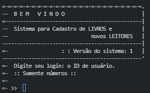
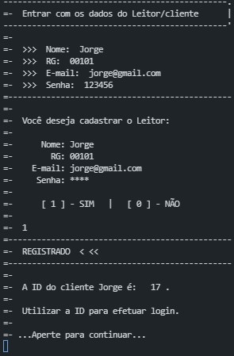
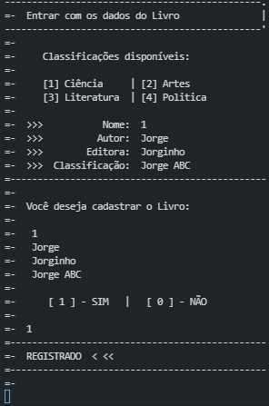
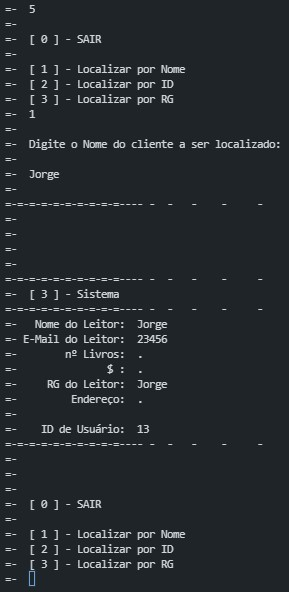
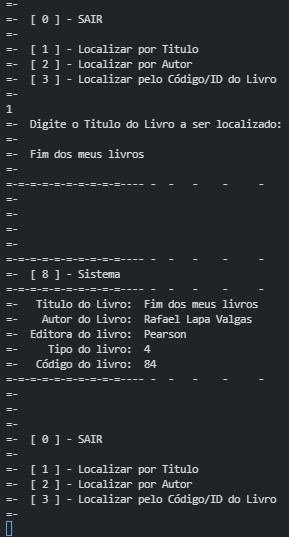

<!-- LANGUAGE -->
<!-- LANGUAGE -->
<!-- LANGUAGE -->
english -
[portuguese](README_pt-br.md)
   

<!-- HEADER -->
<!-- HEADER -->
<!-- HEADER -->
<h1 align="center">Library system</h1>

Final exam in the undergraduate algorithms course.

        

<!-- DATE -->
<!-- DATE -->
<!-- DATE -->

        June,
        2017

 

<!-- LOCAL -->
<!-- LOCAL -->
<!-- LOCAL -->

        Final exam -
        Algorithms

        Análise e Desenvolvimento de Sistemas -
        Centro Universitário de São José

 

<!-- TEXT -->
<!-- TEXT -->
<!-- TEXT -->
<!-- goals -->
<!--  just objectives, no results or opinions.-->

The objective of the project was to develop a CRUD (create, read, update and delete) algorithm that should work at runtime in memory RAM. The students could choose any programming languages. There was no requirement to connect to a database, object orientation or user interface.

<!-- results -->
<!-- just results, no objectives or opinions -->

I developed a command line system in Python. This system had the basic functionalities of a library, such as: registering, searching and renting books, as well registering users and system administrators.

<!-- conclusion -->
<!-- just opinions, no objectives or results -->

The algorithm fulfilled the objectives of the discipline. And even though it was a simple system, it became <i>spaghetti code</i>. However, it was my first code I've seen work and it solved a small real problem. I was very satisfied with the result.

 

<!-- TECH -->
<!-- TECH -->
<!-- TECH -->
## Tech stask

 

<!-- IMAGES -->
<!-- IMAGES -->
<!-- IMAGES -->
## Illustrative images

<!-- ### Image title -->

        

        

        

        

        

        

