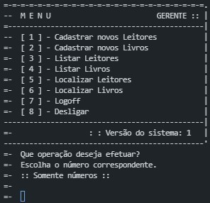
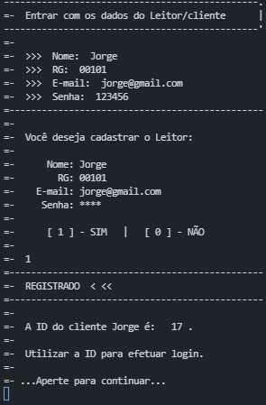
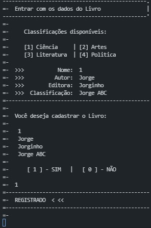
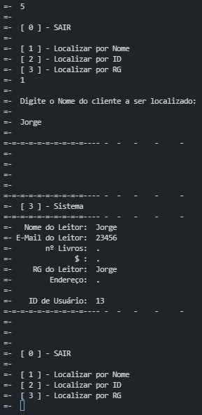
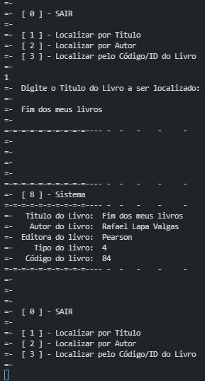

<!-- LANGUAGE -->
<!-- LANGUAGE -->
<!-- LANGUAGE -->
[english](README.md) -
portuguese
   

<!-- HEADER -->
<!-- HEADER -->
<!-- HEADER -->
<h1 align="center">Sistema de biblioteca</h1>

Avaliação final da disciplina de algoritmos da graduação.

        

<!-- DATE -->
<!-- DATE -->
<!-- DATE -->

        Junho,
        2017

 

<!-- LOCAL -->
<!-- LOCAL -->
<!-- LOCAL -->

        Exame final -
        Algoritmos

        Análise e Desenvolvimento de Sistemas -
        Centro Universitário de São José

 

<!-- TEXT -->
<!-- TEXT -->
<!-- TEXT -->
<!-- goals -->
<!--  just objectives, no results or opinions.-->

O objetivo era desenvolver um algoritmo de CRUD que deveria funcionar em tempo de execução na memória RAM. A escolha da linguagem era livre. Não era requisito a conexão com banco de dados, orientação a objetos ou interface de usuário.

<!-- results -->
<!-- just results, no objectives or opinions -->

Eu desenvolvi um sistema de linha de comando em Python. Esse sistema tinha funcionalidades básicas de uma biblioteca, como: cadastrar livros, buscar livros, alugar livro, cadastrar usuários e administradores de sistema.

<!-- conclusion -->
<!-- just opinions, no objectives or results -->

O algoritmo cumpriu os objetivos da disciplina. E mesmo sendo um sistema simples se tornou <i>spaghetti code</i>. No entanto, foi meu primeiro código que vi funcionar e solucionou um pequeno problema real. Fiquei muito satisfeito com o resultado.

 

<!-- TECH -->
<!-- TECH -->
<!-- TECH -->
## Tech stask

 

<!-- IMAGES -->
<!-- IMAGES -->
<!-- IMAGES -->
## Illustrative images

<!-- ### Image title -->

        

        

        

        

        

        

