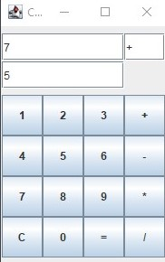

<!-- LANGUAGE -->
<!-- LANGUAGE -->
<!-- LANGUAGE -->
[english](README.md) -
portuguese
   

<!-- HEADER -->
<!-- HEADER -->
<!-- HEADER -->
<h1 align="center">Calculadora em Java Swing</h1>

Exercício em Java Swing para desenvolver uma calculadora.

        

<!-- DATE -->
<!-- DATE -->
<!-- DATE -->

        Junho,
        2019

 

<!-- LOCAL -->
<!-- LOCAL -->
<!-- LOCAL -->

        Exercício Java Swing -
        Linguagem de Programação I

        Análise e Desenvolvimento de Sistemas -
        Centro Universitário de São José

 

<!-- TEXT -->
<!-- TEXT -->
<!-- TEXT -->
<!-- goals -->
<!--  just objectives, no results or opinions.-->

O propósito foi desenvolver uma calculadora utilizando a biblioteca de interface gráfica Java Swing.

<!-- results -->
<!-- just results, no objectives or opinions -->
<!-- 

 -->
<!-- conclusion -->
<!-- just opinions, no objectives or results -->

Desde o princípio desejei que a aplicação desenvolvida apresentasse todos os inputs em um único componente (similar a calculadora windows). Também gostaria que tivesse responsividade no redimensionamento. Mas foi feito o possível com o tempo disponibilizado para o desenvolvimento da atividade. Aqui dei os primeiros passos para compreender o funcionamento das interfaces gráficas e o frontend. 

 

<!-- TECH -->
<!-- TECH -->
<!-- TECH -->
## Tech stask

        

 

<!-- IMAGES -->
<!-- IMAGES -->
<!-- IMAGES -->
## Illustrative images

<!-- ### Image title -->

        

