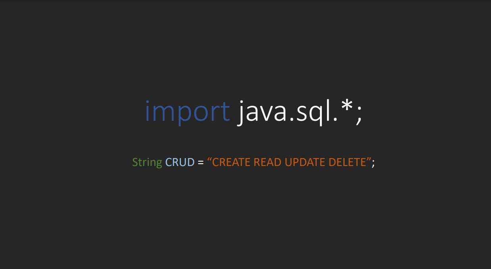

<!-- LANGUAGE -->
<!-- LANGUAGE -->
<!-- LANGUAGE -->
english -
[portuguese](README_pt-br.md)
   

<!-- HEADER -->
<!-- HEADER -->
<!-- HEADER -->
<h1 align="center">Java JDBC</h1>

Java JDBC seminar in the Programming Language I course.

        

<!-- DATE -->
<!-- DATE -->
<!-- DATE -->

        June,
        2019

 

<!-- LOCAL -->
<!-- LOCAL -->
<!-- LOCAL -->

        Java JDBC -
        Linguagem de Programação I

        Análise e Desenvolvimento de Sistemas -
        Centro Universitário de São José

 

<!-- TEXT -->
<!-- TEXT -->
<!-- TEXT -->
<!-- goals -->
<!--  just objectives, no results or opinions.-->

For this school assignment, it was asked to choose a java library and prepare a theoretical and practical presentation using the official documentation as a reference.

<!-- results -->
<!-- just results, no objectives or opinions -->

I chose the <b>java.sql</b> library for database connection. And I prepared a slideshow and a code demo.

<!-- conclusion -->
<!-- just opinions, no objectives or results -->

This activity helped me to consolidate my knowledge about java and JDBC. Furthermore, it made it possible to understand the use of the Adapter designer pattern, more about object orientation and the commonly uses of interface pattern in programming.

 

<!-- TECH -->
<!-- TECH -->
<!-- TECH -->
## Tech stask

        

 

<!-- IMAGES -->
<!-- IMAGES -->
<!-- IMAGES -->
## Illustrative images

<!-- ### Image title -->

        

