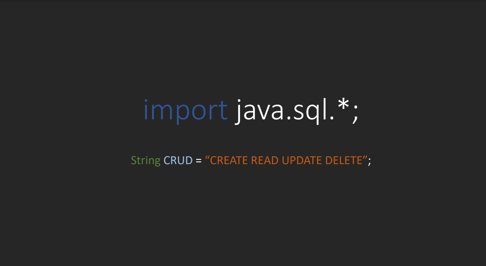

<!-- LANGUAGE -->
<!-- LANGUAGE -->
<!-- LANGUAGE -->
[english](README.md) -
portuguese
   

<!-- HEADER -->
<!-- HEADER -->
<!-- HEADER -->
<h1 align="center">Seminário sobre Java JDBC</h1>

Apresentação sobre o Java JDBC na disciplina de Linguagem de Programação I.

        

<!-- DATE -->
<!-- DATE -->
<!-- DATE -->

        Junho,
        2019

 

<!-- LOCAL -->
<!-- LOCAL -->
<!-- LOCAL -->

        Exercícios de Java JDBC -
        Linguagem de Programação I

        Análise e Desenvolvimento de Sistemas -
        Centro Universitário de São José

 

<!-- TEXT -->
<!-- TEXT -->
<!-- TEXT -->
<!-- goals -->
<!--  just objectives, no results or opinions.-->

Para essa tarefa escolar foi solicitado escolher uma biblioteca java e prepar uma apresentação teórica e prática utilizando como referência a documentação oficial.

<!-- results -->
<!-- just results, no objectives or opinions -->

Eu escolhi a biblioteca <i>java.sql</i> para conexão com o banco de dados. E preparei uma apresentação em slides e uma demonstração do código.

<!-- conclusion -->
<!-- just opinions, no objectives or results -->

Esta atividade me ajudou a consolidar meus conhecimentos sobre java e JDBC. Além disso, possibilitou entender o uso do padrão de designer Adapter, mais sobre orientação a objetos e os usos comuns de interfaces na programação.

 

<!-- TECH -->
<!-- TECH -->
<!-- TECH -->
## Tech stask

        

 

<!-- IMAGES -->
<!-- IMAGES -->
<!-- IMAGES -->
## Illustrative images

<!-- ### Image title -->

        

