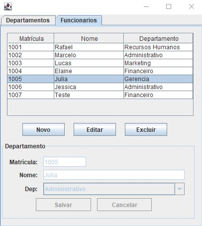

<!-- LANGUAGE -->
<!-- LANGUAGE -->
<!-- LANGUAGE -->
english -
[portuguese](README_pt-br.md)
   

<!-- HEADER -->
<!-- HEADER -->
<!-- HEADER -->
<h1 align="center">Java</h1>

Consolidating Java learning and studies on GUI (Graphical User Interface) of desktop applications.

        

<!-- DATE -->
<!-- DATE -->
<!-- DATE -->

        June,
        2019

 

<!-- LOCAL -->
<!-- LOCAL -->
<!-- LOCAL -->

        <!-- Java  - -->
        Java

        <!-- Análise e Desenvolvimento de Sistemas - -->
        Studies at home

 

<!-- TEXT -->
<!-- TEXT -->
<!-- TEXT -->
<!-- goals -->
<!--  just objectives, no results or opinions.-->

After the experience with the <a href="../20190604_usj_calculator_swing_gui/README.md">development of GUI with the Swing library</a>, I decided to explore another library to understand the differences between the frameworks. In addition, I decided to consolidate the learning of java, database connections and the systems architecture. So, I challenged myself to develop three applications that shared the same infrastructure. The only difference between the applications was the business and data modeling.

<!-- results -->
<!-- just results, no objectives or opinions -->

A prototype application for user authentication was developed, making it possible to register and validate the login. A prototype human resources system, making it possible to register departments, positions and functions. And a topic annotation system, making it possible register tasks in a specific topic. The applications shared the infrastructure. The three applications used the MVC (Model-View-Controller) system architecture pattern, Docker as infrastructure for the MySQL database and java jFrame for the development of the graphical interface.

<!-- conclusion -->
<!-- just opinions, no objectives or results -->

This challenge was important to practice and realize the importance of system architecture and the separation of responsibilities into independent layers.

 

<!-- TECH -->
<!-- TECH -->
<!-- TECH -->
## Tech stask

        
        
        

 

<!-- IMAGES -->
<!-- IMAGES -->
<!-- IMAGES -->
## Illustrative images

### Cadastros

        
        

### Human Resources system

        
        

### Schedule

        

