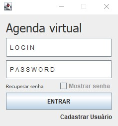
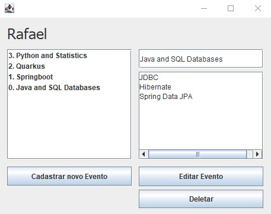

<!-- LANGUAGE -->
<!-- LANGUAGE -->
<!-- LANGUAGE -->
[english](README.md) -
portuguese
   

<!-- HEADER -->
<!-- HEADER -->
<!-- HEADER -->
<h1 align="center">Java</h1>

Consolidando aprendizagem de Java e estudos sobre interface gráfica de aplicações desktop.

        

<!-- DATE -->
<!-- DATE -->
<!-- DATE -->

        Junho,
        2019

 

<!-- LOCAL -->
<!-- LOCAL -->
<!-- LOCAL -->

        <!-- Java  - -->
        Java

        <!-- Análise e Desenvolvimento de Sistemas - -->
        Estudos em casa

 

<!-- TEXT -->
<!-- TEXT -->
<!-- TEXT -->
<!-- goals -->
<!--  just objectives, no results or opinions.-->

Após a experiência com o <a href="../20190604_usj_calculator_swing_gui/README.md">desenvolvimento de interfaces gráficas com a biblioteca Swing</a>, decidi explorar outra biblioteca para perceber as diferenças entre os frameworks. Além disso, decidi consolidar a aprendizagem de java, conexões com banco de dados e as bases da arquitetura de sistemas desktop. Assim, me desafiei a desenvolver três aplicações que compartilhassem os mesmos padrões de projetos. A única diferença entre as aplicações foi a regra de negócio e a modelagem de dados.

<!-- results -->
<!-- just results, no objectives or opinions -->

Foi desenvolvido um aplicativo protótipo para autenticação de usuários, possibilitando o cadastro e validação do login. Um protótipo de sistema de recursos humanos, possibilitando o cadastro de departamentos, cargos e funções. E um sistema de anotação de tópicos, possibilitando o registro de tarefas em um tópico específico. Os aplicativos compartilharam a infraestrutura. As três aplicações utilizaram o padrão de arquitetura do sistema MVC (Model-View-Controller), Docker como infraestrutura para o banco de dados MySQL e java jFrame para o desenvolvimento da interface gráfica.

<!-- conclusion -->
<!-- just opinions, no objectives or results -->

Esse desafio foi importante para praticar e perceber a importância de padrões de projeto e a separação das responsabilidades em camadas independentes.

 

<!-- TECH -->
<!-- TECH -->
<!-- TECH -->
## Tech stask

        
        
        

 

<!-- IMAGES -->
<!-- IMAGES -->
<!-- IMAGES -->
## Illustrative images

### Cadastros

        
        

### Human Resources system

        
        

### Schedule

        

