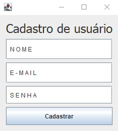
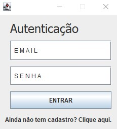
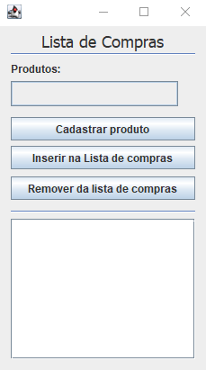

<!-- LANGUAGE -->
<!-- LANGUAGE -->
<!-- LANGUAGE -->
english -
[portuguese](README_pt-br.md)
   

<!-- HEADER -->
<!-- HEADER -->
<!-- HEADER -->
<h1 align="center">Final Assessment of Linguagem de Programação I</h1>

Final assessment for approval in the Programming Language I class.

        

<!-- DATE -->
<!-- DATE -->
<!-- DATE -->

        June,
        2019

 

<!-- LOCAL -->
<!-- LOCAL -->
<!-- LOCAL -->

        Final assessment -
        Linguagem de Programação I

        Análise e Desenvolvimento de Sistemas -
        Centro Universitário de São José

 

<!-- TEXT -->
<!-- TEXT -->
<!-- TEXT -->
<!-- goals -->
<!--  just objectives, no results or opinions.-->

For the evaluation, an IP address (Internet Protocol) that directed to a MySQL database was made available for students. The objective was to develop a GUI (Graphical User Interface) application in MVC (Model-View-Controller) architecture pattern capable of connecting to the available database. Having approximately 4 hours to develop the solution.

<!-- results -->
<!-- just results, no objectives or opinions -->

The first part of the system was the authentication, consisting of two screens, one for registration and another for user authentication. The second part of the system was the registration of a shopping list by authenticated users.

<!-- conclusion -->
<!-- just opinions, no objectives or results -->
<!-- 

 -->
 

<!-- TECH -->
<!-- TECH -->
<!-- TECH -->
## Tech stask

        
        

 

<!-- IMAGES -->
<!-- IMAGES -->
<!-- IMAGES -->
## Illustrative images

### Authentication app

        
        

### Shopping list app

        

