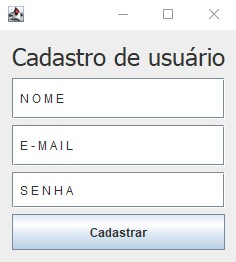
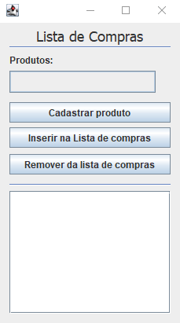

<!-- LANGUAGE -->
<!-- LANGUAGE -->
<!-- LANGUAGE -->
[english](README.md) -
portuguese
   

<!-- HEADER -->
<!-- HEADER -->
<!-- HEADER -->
<h1 align="center">Avaliação final de Linguagem de Programação I</h1>

Avaliação final para aprovação na disciplina de Linguagem de Programação I.

        

<!-- DATE -->
<!-- DATE -->
<!-- DATE -->

        Junho,
        2019

 

<!-- LOCAL -->
<!-- LOCAL -->
<!-- LOCAL -->

        Avaliação final -
        Linguagem de Programação I

        Análise e Desenvolvimento de Sistemas -
        Centro Universitário de São José

 

<!-- TEXT -->
<!-- TEXT -->
<!-- TEXT -->
<!-- goals -->
<!--  just objectives, no results or opinions.-->

Para a avaliação, foi disponibilizado para os alunos um endereço IP que direcionava para um banco de dados MySQL temporario. O objetivo foi desenvolver uma aplicação de interface gráfica no padrão de arquitetura MVC capaz de se conectar a esse banco de dados. Tendo aproximadamente 4 horas para desenvolver a solução.

<!-- results -->
<!-- just results, no objectives or opinions -->

A primeira parte do sistema foi o de autenticação, composta de duas telas, uma para cadastro e outra para autenticação do usuário. A segunda parte do sistema foi o de cadastro de uma lista de compras por usuários autenticados.

<!-- conclusion -->
<!-- just opinions, no objectives or results -->
<!-- 

 -->
 

<!-- TECH -->
<!-- TECH -->
<!-- TECH -->
## Tech stask

        
        

 

<!-- IMAGES -->
<!-- IMAGES -->
<!-- IMAGES -->
## Illustrative images

### Authentication app

        
        

### Shopping list app

        

