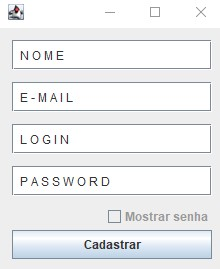
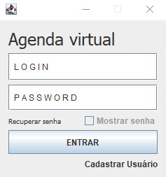
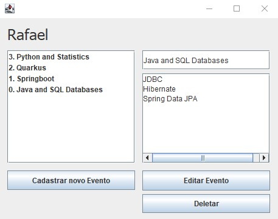

<!-- LANGUAGE -->
<!-- LANGUAGE -->
<!-- LANGUAGE -->
english -
[portuguese](README_pt-br.md)
   

<!-- HEADER -->
<!-- HEADER -->
<!-- HEADER -->
<h1 align="center">Final Assessment of Programming Language I and Database I</h1>

Final assessment for approval in the Programming Language I and Database I classes.

        

<!-- DATE -->
<!-- DATE -->
<!-- DATE -->

        June,
        2019

 

<!-- LOCAL -->
<!-- LOCAL -->
<!-- LOCAL -->

        Final assessment -
        Banco de Dados I e Linguagem de Programação I

        Análise e Desenvolvimento de Sistemas -
        Centro Universitário de São José

 

<!-- TEXT -->
<!-- TEXT -->
<!-- TEXT -->
<!-- goals -->
<!--  just objectives, no results or opinions.-->

In addition to the final exams, the course required to the development of an application as a way of evaluating student performance. This application should use all the concepts learned during the semester. Therefore, java, database connection, entity relationship modeling and desktop graphical interfaces; as well as design patterns and object orientation.

<!-- results -->
<!-- just results, no objectives or opinions -->

I worked on to improving my <a href="../20190625_stu_jFrame_and_become_java_developer/README.md">task planning system</a>. In this system, each user is free to create a topic and relate a to-do list to that topic. The entire system was developed with Docker, MySQL, Java, JDBC and jFrame; MVC design patterns, object orientation, and graphical interface; all these technologies were studied and practiced in previous projects.

<!-- conclusion -->
<!-- just opinions, no objectives or results -->

From a UX (User Experience) point of view, the application is not fully functional, but it served the purposes of the course evaluation. The development of this application contributed to practice and consolidate programming skills with related technologies.

 

<!-- TECH -->
<!-- TECH -->
<!-- TECH -->
## Tech stask

        
        
        

 

<!-- IMAGES -->
<!-- IMAGES -->
<!-- IMAGES -->
## Illustrative images

### Schedule authentication

        
        

### Schedule app

        

