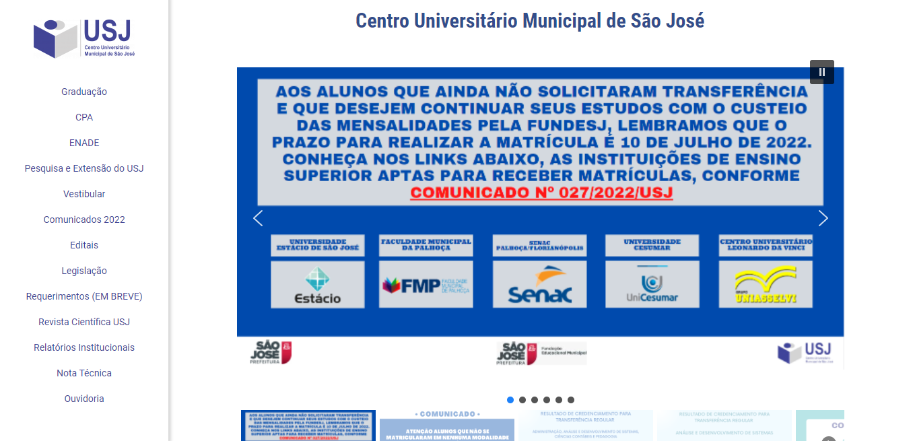
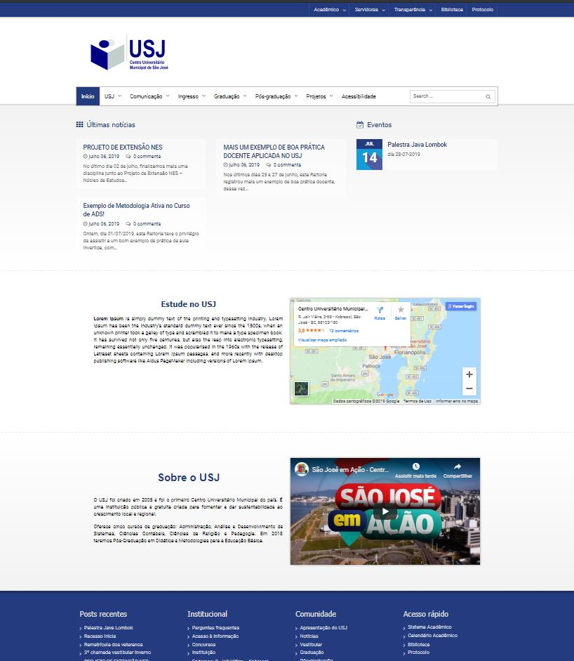
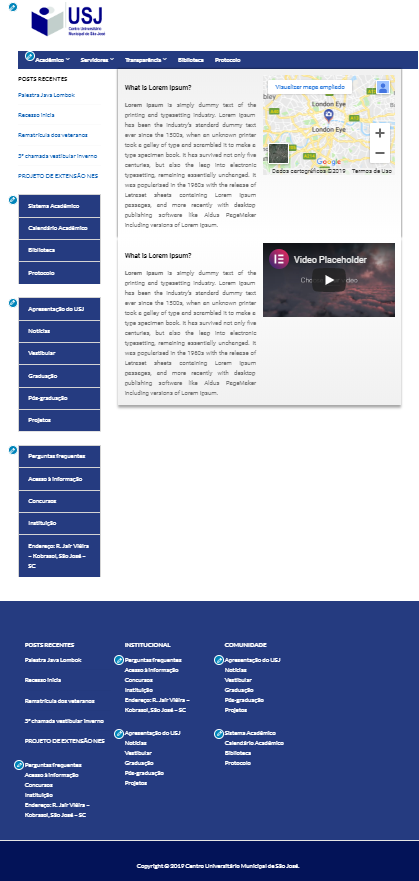
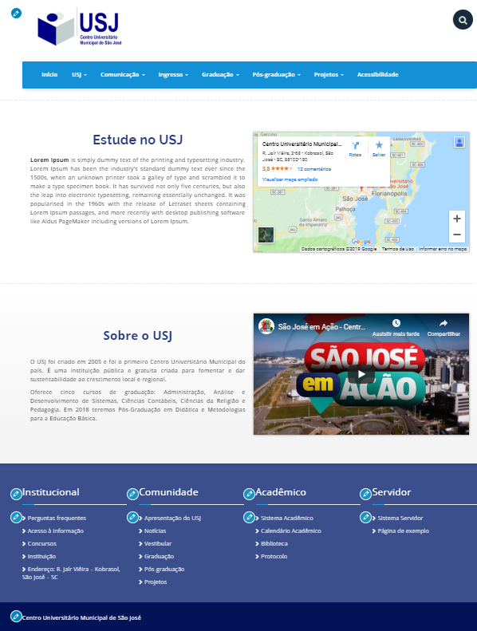

<!-- LANGUAGE -->
<!-- LANGUAGE -->
<!-- LANGUAGE -->
english -
[portuguese](README_pt-br.md)
   

<!-- HEADER -->
<!-- HEADER -->
<!-- HEADER -->
<h1 align="center">University extension project</h1>

Development layouts for the institutional website of the USJ.

        

<!-- DATE -->
<!-- DATE -->
<!-- DATE -->

        July,
        2019

 

<!-- LOCAL -->
<!-- LOCAL -->
<!-- LOCAL -->

        Wordpress -
        Project Extension

        Análise e Desenvolvimento de Sistemas -
        Centro Universitário de São José

 

<!-- TEXT -->
<!-- TEXT -->
<!-- TEXT -->
<!-- goals -->
<!--  just objectives, no results or opinions.-->

The University extension project is a way to training the students to job market with extracurricular activities and in return receive services provided by students. It was asked to change the usability to improve the UX (Users eXperience) of the institutional website, that is, to facilitate the navigation between the institutional documents for the administrative team, to students and to the community in general. The institutional website work with the CMMS (Computerized Maintenance Management System) Wordpress framework and the MySQL database.

<!-- results -->
<!-- just results, no objectives or opinions -->

In this process I developed three different layouts.

<!-- conclusion -->
<!-- just opinions, no objectives or results -->

This was my first experience with a CMMS framework and UX concepts. Here I learned a lot about CSS (Cascading Style Sheets), frontend in general and layout development.

Unfortunately, in 2021, the municipality of São José decided to close the university definitively, considering it an unnecessary cost to the municipality. Thus, in 2022 the Centro Universitário de São José (USJ) definitively closed and students were transferred to different private universities in the region.

 

<!-- TECH -->
<!-- TECH -->
<!-- TECH -->
## Tech stask

        
        
        
                

 

<!-- IMAGES -->
<!-- IMAGES -->
<!-- IMAGES -->
## Illustrative images

### Layout padrão institucional 2019 (BASE)

        

### Modelo desenvolvido 1 :: Escolhido por nós

        

### Modelo desenvolvido 2 :: Escolhido por nós

        

### Modelo desenvolvido 3 :: descartado para apresentar

        

