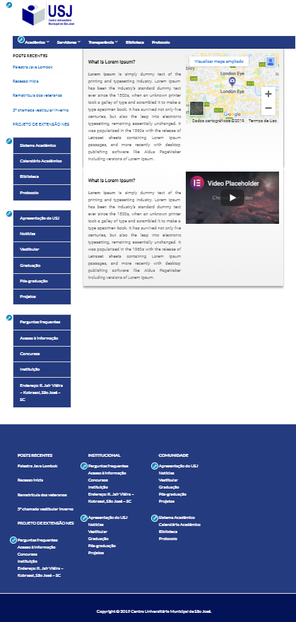

<!-- LANGUAGE -->
<!-- LANGUAGE -->
<!-- LANGUAGE -->
[english](README.md) -
portuguese
   

<!-- HEADER -->
<!-- HEADER -->
<!-- HEADER -->
<h1 align="center">Projeto extensão universitária</h1>

Desenvolvimento de layouts para o website institucional do USJ. 

        

<!-- DATE -->
<!-- DATE -->
<!-- DATE -->

        Julho,
        2019

 

<!-- LOCAL -->
<!-- LOCAL -->
<!-- LOCAL -->

        Wordpress -
        Projeto extensão

        Análise e Desenvolvimento de Sistemas -
        Centro Universitário de São José

 

<!-- TEXT -->
<!-- TEXT -->
<!-- TEXT -->
<!-- goals -->
<!--  just objectives, no results or opinions.-->

O projeto de extensão universitária é uma forma de capacitar os alunos para o mercado de trabalho com atividades extracurriculares e em troca receber serviços prestados pelos alunos. Foi solicitada a alteração da usabilidade para melhorar o UX do site institucional, ou seja, facilitar a navegação entre os documentos institucionais para a equipe administrativa, para os alunos e para a comunidade em geral. O site institucional funciona com o framework CMMS Wordpress e o banco de dados MySQL.

<!-- results -->
<!-- just results, no objectives or opinions -->

Neste processo desenvolvi três layouts diferentes.

<!-- conclusion -->
<!-- just opinions, no objectives or results -->

Essa foi minha primeira experiência com framework CMMS e conceitos de UX. Aprendi muito sobre CSS, frontend em geral e desenvolvimento de layout.

Infelizmente, em 2021, o município de São José decidiu fechar definitivamente a universidade, considerando um custo desnecessário para o município. Assim, em 2022 o Centro Universitário de São José (USJ) fechou definitivamente e os alunos foram transferidos para diferentes universidades privadas da região.

 

<!-- TECH -->
<!-- TECH -->
<!-- TECH -->
## Tech stask

        
        
        
                

 

<!-- IMAGES -->
<!-- IMAGES -->
<!-- IMAGES -->
## Illustrative images

### Layout padrão institucional 2019

        

### Modelo desenvolvido 1 :: Escolhido por nós

        

### Modelo desenvolvido 2 :: Escolhido por nós

        

### Modelo desenvolvido 3 :: descartado para apresentar

        

