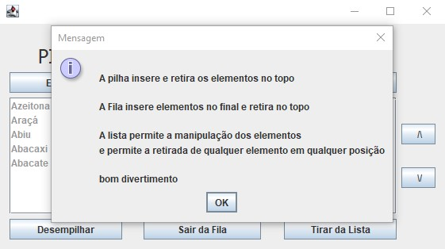

<!-- LANGUAGE -->
<!-- LANGUAGE -->
<!-- LANGUAGE -->
english -
[portuguese](README_pt-br.md)
   

<!-- HEADER -->
<!-- HEADER -->
<!-- HEADER -->
<h1 align="center">Data Structure Visualization</h1>

Basic studies to practice the concepts of data structure.

        

<!-- DATE -->
<!-- DATE -->
<!-- DATE -->

        August,
        2019

 

<!-- LOCAL -->
<!-- LOCAL -->
<!-- LOCAL -->

        Data Structure in Java -
        Linguagem de Programação II

        Análise e Desenvolvimento de Sistemas -
        Centro Universitário de São José

 

<!-- TEXT -->
<!-- TEXT -->
<!-- TEXT -->
<!-- goals -->
<!--  just objectives, no results or opinions.-->

The objective of this task was to develop an application with a GUI (Graphical User Interface) only to explicitly visualize the concepts of data structure. This application works in a way that the user can see the initial list of fruits words and manipulate this using the structure of linked list, stack and queue in the developed interface.

<!-- results -->
<!-- just results, no objectives or opinions -->

The application was developed using java swing.

<!-- conclusion -->
<!-- just opinions, no objectives or results -->

This was a fairly simple task, because it was not necessary to implement the algorithms that manipulate the arrays to build these data structures; but just to use the java library set. The final result has its didactic value to visually the different behaviors of the most used data structures.

 

<!-- TECH -->
<!-- TECH -->
<!-- TECH -->
## Tech stask

        

 

<!-- IMAGES -->
<!-- IMAGES -->
<!-- IMAGES -->
## Illustrative images

### Image title

        

        

        

