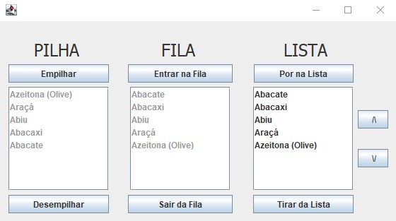
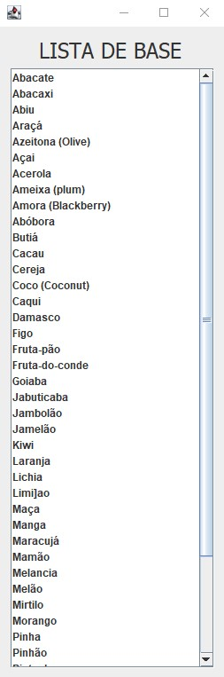

<!-- LANGUAGE -->
<!-- LANGUAGE -->
<!-- LANGUAGE -->
[english](README.md) -
portuguese
   

<!-- HEADER -->
<!-- HEADER -->
<!-- HEADER -->
<h1 align="center">Visualização de estrutura de dados</h1>

Estudos básicos para praticar os conceitos de estrutura de dados.

        

<!-- DATE -->
<!-- DATE -->
<!-- DATE -->

        Agosto,
        2019

 

<!-- LOCAL -->
<!-- LOCAL -->
<!-- LOCAL -->

        Estrutura de dados em Java -
        Linguagem de Programação II

        Análise e Desenvolvimento de Sistemas -
        Centro Universitário de São José

 

<!-- TEXT -->
<!-- TEXT -->
<!-- TEXT -->
<!-- goals -->
<!--  just objectives, no results or opinions.-->

O objetivo desta tarefa foi desenvolver uma aplicação com uma GUI (Graphical User Interface) apenas para visualizar explicitamente os conceitos de estrutura de dados. Esta aplicação funciona de forma que o usuário possa visualizar a lista inicial de palavras de frutas e manipulá-la utilizando a estrutura de lista encadeada, pilha e fila na interface desenvolvida.

<!-- results -->
<!-- just results, no objectives or opinions -->

A aplicação foi desenvolvida utilizando simplesmente java swing.

<!-- conclusion -->
<!-- just opinions, no objectives or results -->

Esta foi uma tarefa bastante simples, pois não foi necessário implementar os algoritmos que manipulam os arrays para construir essas estruturas de dados; mas apenas para usar o conjunto de bibliotecas java. O resultado final tem seu valor didático para esclarecer visualmente os diferentes comportamentos das estruturas de dados mais utilizadas.

 

<!-- TECH -->
<!-- TECH -->
<!-- TECH -->
## Tech stask

        

 

<!-- IMAGES -->
<!-- IMAGES -->
<!-- IMAGES -->
## Illustrative images

### Image title

        

        

        

