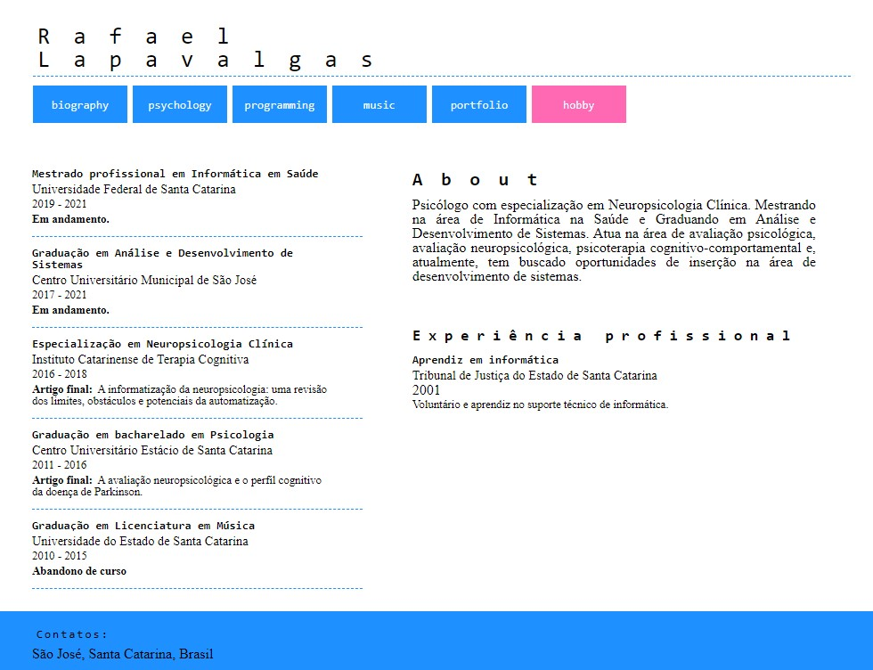

<!-- LANGUAGE -->
<!-- LANGUAGE -->
<!-- LANGUAGE -->
english -
[portuguese](README_pt-br.md)
   

<!-- HEADER -->
<!-- HEADER -->
<!-- HEADER -->
<h1 align="center">Developing a personal portfolio</h1>

This was my first experience with frontend in a personal project.

        

<!-- DATE -->
<!-- DATE -->
<!-- DATE -->

        October,
        2019

 

<!-- LOCAL -->
<!-- LOCAL -->
<!-- LOCAL -->

        Jekyll, JavaScript, HTML e CSS -
        Portfólio

        <!-- Estudos - -->
        Studies at home

 

<!-- TEXT -->
<!-- TEXT -->
<!-- TEXT -->
<!-- goals -->
<!--  just objectives, no results or opinions.-->

The objective here was primarily to explore new technologies and the frontend web development. For that I decided to developing a small personal portfolio. The technologies chosen were basically HTML, CSS and JavaScript, Ruby and Jekyll.

<!-- results -->
<!-- just results, no objectives or opinions -->

In this study I try to review and learn about good practices with HTML and CSS, so I study BEM (Block-Element-Modifier) ​​standard for styling HTML elements. I also explored how JavaScript works and how it manipulates elements in the DOM (Document Object Model). And to dynamically generate components I used Ruby and Jekyll.

<!-- conclusion -->
<!-- just opinions, no objectives or results -->

Even today, the final result pleases me, but the flaws are evident: firstly, I consider the choice of Ruby and Jekyll language and framework good for the study and learning process, but not very relevant for the purposes of the project itself; other frameworks would have been simpler and more effective. In addition, my difficulties with UX and color distribution are evident. Finally, the project becomes complex to maintain and stayed to be redone in the future. This study generated great results and learning that guarantees my understanding of frontend until today.

 

<!-- TECH -->
<!-- TECH --> 
<!-- TECH -->
## Tech stask

        
        
        
        
        

 

<!-- IMAGES -->
<!-- IMAGES -->
<!-- IMAGES -->
## Illustrative images

<!-- ### Image title -->

        

