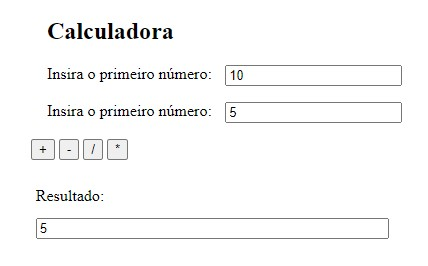
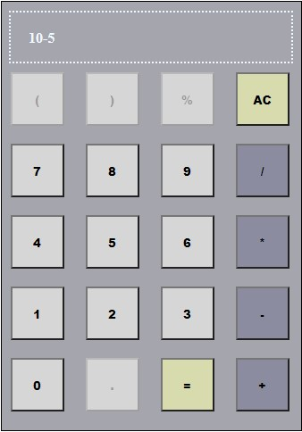

<!-- LANGUAGE -->
<!-- LANGUAGE -->
<!-- LANGUAGE -->
english -
[portuguese](README_pt-br.md)
   

<!-- HEADER -->
<!-- HEADER -->
<!-- HEADER -->
<h1 align="center">Web calculator</h1>

Basic frontend web development studies

        

<!-- DATE -->
<!-- DATE -->
<!-- DATE -->

        October,
        2019

 

<!-- LOCAL -->
<!-- LOCAL -->
<!-- LOCAL -->

        Web Calculator -
        Linguagem de Programação II

        Análise e Desenvolvimento de Sistemas -
        Centro Universitário de São José

 

<!-- TEXT -->
<!-- TEXT -->
<!-- TEXT -->
<!-- goals -->
<!--  just objectives, no results or opinions.-->

The task objective it was to develop two calculators to experiment with HTML, CSS, and JavaScript web development technologies.

<!-- results -->
<!-- just results, no objectives or opinions -->

One of the calculators was developed with web forms and the other with a GUI (Graphical User Interface).

<!-- conclusion -->
<!-- just opinions, no objectives or results -->

This experience improved my understanding of using JavaScript to manipulate the DOM and CSS to change the appearance of HTML elements.

 

<!-- TECH -->
<!-- TECH -->
<!-- TECH -->
## Tech stask

        
        
        

 

<!-- IMAGES -->
<!-- IMAGES -->
<!-- IMAGES -->
## Illustrative images

### Image title

        

### Image title

        

