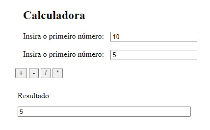
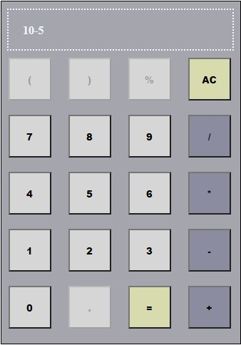

<!-- LANGUAGE -->
<!-- LANGUAGE -->
<!-- LANGUAGE -->
[english](README.md) -
portuguese
   

<!-- HEADER -->
<!-- HEADER -->
<!-- HEADER -->
<h1 align="center">Calculadora Web</h1>

Estudos de desenvolvimento web frontend básico

        

<!-- DATE -->
<!-- DATE -->
<!-- DATE -->

        Outubro,
        2019

 

<!-- LOCAL -->
<!-- LOCAL -->
<!-- LOCAL -->

        Calculadora Web -
        Linguagem de Programação II

        Análise e Desenvolvimento de Sistemas -
        Centro Universitário de São José

 

<!-- TEXT -->
<!-- TEXT -->
<!-- TEXT -->
<!-- goals -->
<!--  just objectives, no results or opinions.-->

O objetivo dessa tarefa foi desenvolver duas calculadoras para experimentar as tecnologias de desenvolvimento web HTML, CSS e JavaScript.

<!-- results -->
<!-- just results, no objectives or opinions -->

Uma das calculadoras foi desenvolvida com formulários web e a outra com interface gráfica.

<!-- conclusion -->
<!-- just opinions, no objectives or results -->

Essa experiência melhorou meu entendimento sobre o uso do JavaScript para manipular o DOM e do CSS para alterar a aparência dos elementos HTML.

 

<!-- TECH -->
<!-- TECH -->
<!-- TECH -->
## Tech stask

        
        
        

 

<!-- IMAGES -->
<!-- IMAGES -->
<!-- IMAGES -->
## Illustrative images

### Image title

        

### Image title

        

