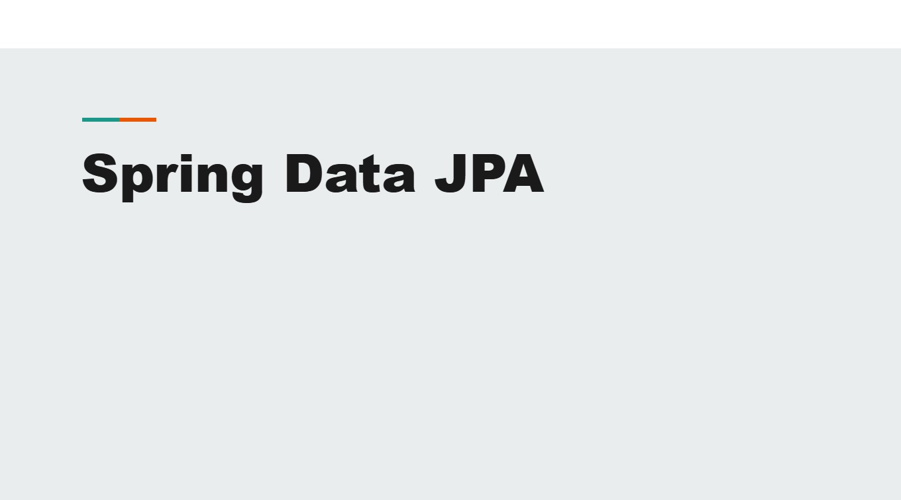
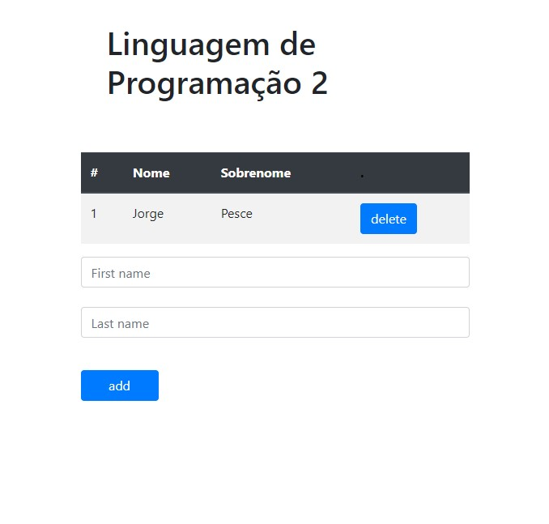

<!-- LANGUAGE -->
<!-- LANGUAGE -->
<!-- LANGUAGE -->
english -
[portuguese](README_pt-br.md)
   

<!-- HEADER -->
<!-- HEADER -->
<!-- HEADER -->
<h1 align="center">Spring</h1>

Spring and ORM seminar in the Programming Language II

        

<!-- DATE -->
<!-- DATE -->
<!-- DATE -->

        October,
        2019

 

<!-- LOCAL -->
<!-- LOCAL -->
<!-- LOCAL -->

        Java Spring -
        Linguagem de Programação II

        Análise e Desenvolvimento de Sistemas -
        Centro Universitário de São José

 

<!-- TEXT -->
<!-- TEXT -->
<!-- TEXT -->
<!-- goals -->
<!--  just objectives, no results or opinions.-->

For this task, students should choose a web framework from a list provided by the teacher and prepare a presentation with a practical demonstration. I choose Spring framework and Spring Data JPA.

<!-- results -->
<!-- just results, no objectives or opinions -->

It was necessary to study and understand the concepts of ORM (Object-Relational Mapping) and the implementations such as EclipseLink, Hibernate and Spring Data JPA. Then, I prepare the slideshow and the demo application that consisted of including and excluding elements in a list, using Docker, MySQL Spring Data JPA and Thymeleaf.

<!-- conclusion -->
<!-- just opinions, no objectives or results -->

From this experience, I choose Java and Spring as my development stack.

 

<!-- TECH -->
<!-- TECH -->
<!-- TECH -->
## Tech stask

        
        
        

 

        
        
        
        

 

        
        

 

<!-- IMAGES -->
<!-- IMAGES -->
<!-- IMAGES -->
## Illustrative images

### Slide

        

### Demo Application

        

