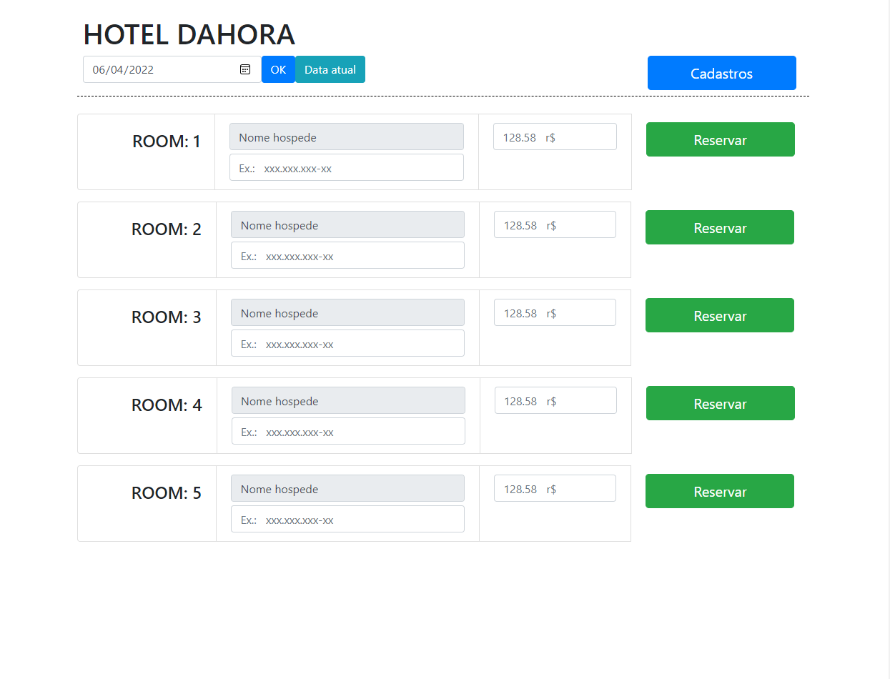

<!-- LANGUAGE -->
<!-- LANGUAGE -->
<!-- LANGUAGE -->
english -
[portuguese](README_pt-br.md)
   

<!-- HEADER -->
<!-- HEADER -->
<!-- HEADER -->
<h1 align="center">Sistema de Hotel</h1>

Esse projeto foi a avaliação final da disciplina de Linguagem de Programação II.

        

<!-- DATE -->
<!-- DATE -->
<!-- DATE -->

        Dezembro,
        2019

 

<!-- LOCAL -->
<!-- LOCAL -->
<!-- LOCAL -->

        Hotel -
        Linguagem de Programação II

        Análise e Desenvolvimento de Sistemas -
        Centro Universitário de São José

 

<!-- TEXT -->
<!-- TEXT -->
<!-- TEXT -->
<!-- goals -->
<!--  just objectives, no results or opinions.-->

As a final project was requested from students the development of a web system using some of the technologies studied during the course. The technologies chosen were HTML, CSS, JavaScript, Bootstrap, Java, Servlets, JSP, Spring, Spring Data JPA and Thymeleaf.

<!-- results -->
<!-- just results, no objectives or opinions -->

I chose to develop a hotel system capable of scheduling a room for a client at a certain date and time. The project used MVC (Model-View-Controller) pattern to structure the application. A relational database with MySQL provided by Docker. I also chose to develop the application in two versions: the first using Java JSP and JDBC and the second using Java Spring and Spring Data JPA.

<!-- conclusion -->
<!-- just opinions, no objectives or results -->

I took advantage of the final activity of the course to develop skills with both technologies. This allowed me to have a good understanding of how Spring abstracts some more basic Java operations. This was the first time I developed a complete web application that solves a small practical problem. This experience gave me a greater understanding of the scope of web development and I started to feel much more confident to call myself a developer and apply for jobs.

 

<!-- TECH -->
<!-- TECH -->
<!-- TECH -->
## Tech stask

        
        
        

 

        
        
        
        

 

        
        

 

<!-- IMAGES -->
<!-- IMAGES -->
<!-- IMAGES -->
## Illustrative images

<!-- ### Image title -->

        

<!-- ### Image title -->

        

