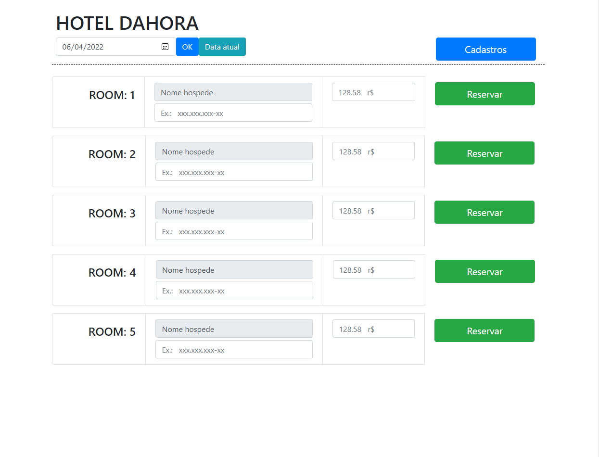
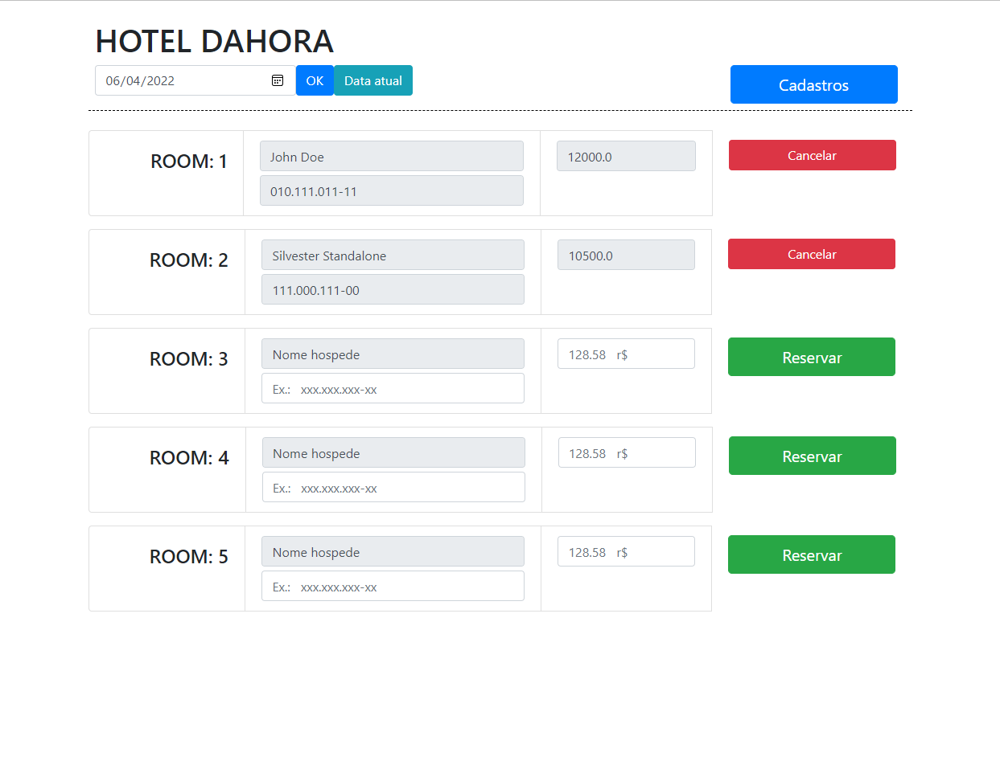

<!-- LANGUAGE -->
<!-- LANGUAGE -->
<!-- LANGUAGE -->
[english](README.md) -
portuguese
   

<!-- HEADER -->
<!-- HEADER -->
<!-- HEADER -->
<h1 align="center">Sistema Hoteleiro</h1>

Este projeto foi a avaliação final do curso de Linguagem de Programação II.

        

<!-- DATE -->
<!-- DATE -->
<!-- DATE -->

        Dezembro,
        2019

 

<!-- LOCAL -->
<!-- LOCAL -->
<!-- LOCAL -->

        Hotel -
        Linguagem de Programação II

        Análise e Desenvolvimento de Sistemas -
        Centro Universitário de São José

 

<!-- TEXT -->
<!-- TEXT -->
<!-- TEXT -->
<!-- goals -->
<!--  just objectives, no results or opinions.-->

Como projeto final foi solicitado aos alunos o desenvolvimento de um sistema web utilizando algumas das tecnologias estudadas durante o curso. As tecnologias escolhidas foram HTML, CSS, JavaScript, Bootstrap, Java, Servlets, JSP, Spring, Spring Data JPA e Thymeleaf.

<!-- results -->
<!-- just results, no objectives or opinions -->

Optei por desenvolver um sistema hoteleiro capaz de agendar um quarto para um cliente em uma determinada data e horário. O projeto utilizou o padrão MVC para estruturar a aplicação. Um banco de dados relacional com MySQL fornecido pelo Docker. Optei também por desenvolver a aplicação em duas versões: a primeira utilizando Java JSP e JDBC e a segunda utilizando Java Spring e Spring Data JPA.

<!-- conclusion -->
<!-- just opinions, no objectives or results -->

Aproveitei a atividade final da disciplina para desenvolver habilidades com ambas as tecnologias. Isso me possibilitou ter um bom entendimento de como o Spring abstrair algumas operações mais básicas do Java. Essa foi a primeira vez que desenvolvi uma aplicação web completa que soluciona um pequeno problema prático. Essa experiência me deu uma maior compreensão sobre o escopo de desenvolvimento web e passei a me sentir muito mais confiante para me denominar um desenvolvedor e concorrer a vagas de emprego.

 

<!-- TECH -->
<!-- TECH -->
<!-- TECH -->
## Tech stask

        
        
        

 

        
        
        
        

 

        
        

 

<!-- IMAGES -->
<!-- IMAGES -->
<!-- IMAGES -->
## Illustrative images

<!-- ### Image title -->

        

<!-- ### Image title -->

        

