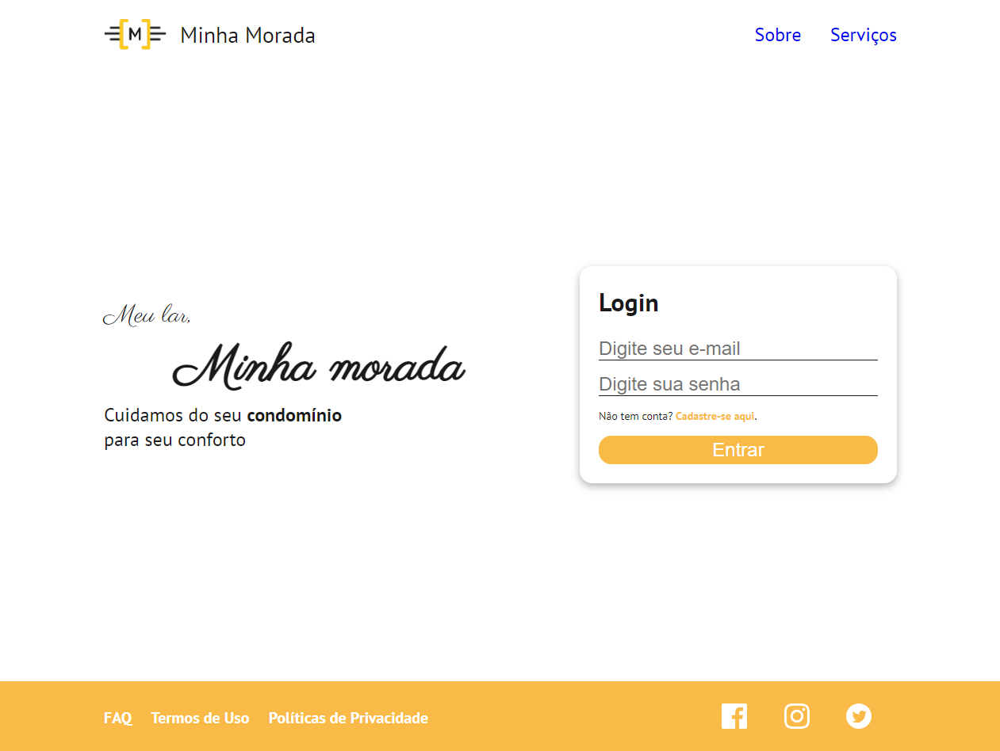

<!-- LANGUAGE -->
<!-- LANGUAGE -->
<!-- LANGUAGE -->
[english](README.md) -
portuguese
   

<!-- HEADER -->
<!-- HEADER -->
<!-- HEADER -->
<h1 align="center">Minha Morada</h1>

Esse projeto foi resultado de uma aula sobre boas práticas de HTML e CSS.

        

<!-- DATE -->
<!-- DATE -->
<!-- DATE -->

        Junho,
        2020

 

 

<!-- TEXT -->
<!-- TEXT -->
<!-- TEXT -->
<!-- goals -->
<!--  just objectives, no results or opinions.-->

Esse projeto é resultado de uma aula de boas práticas na estruturação e estilização dos elementos HTML com CSS.

 

<!-- TECH -->
<!-- TECH -->
<!-- TECH -->
## Tech stask

        
        
        

 

<!-- IMAGES -->
<!-- IMAGES -->
<!-- IMAGES -->
## Illustrative images

<!-- ### Image title -->

        

