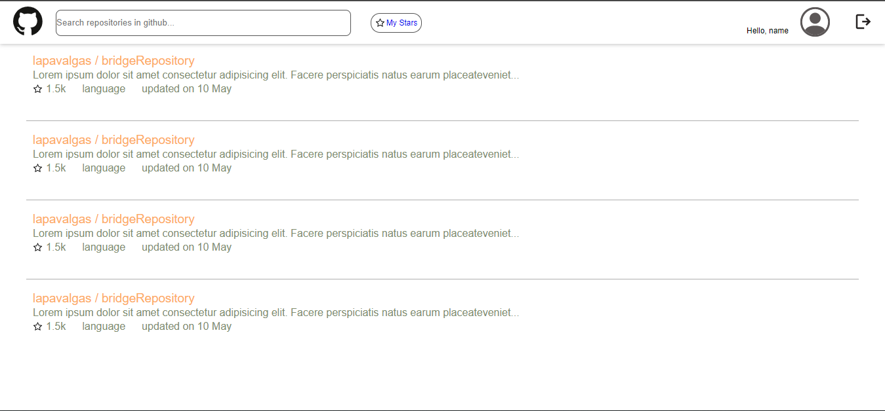
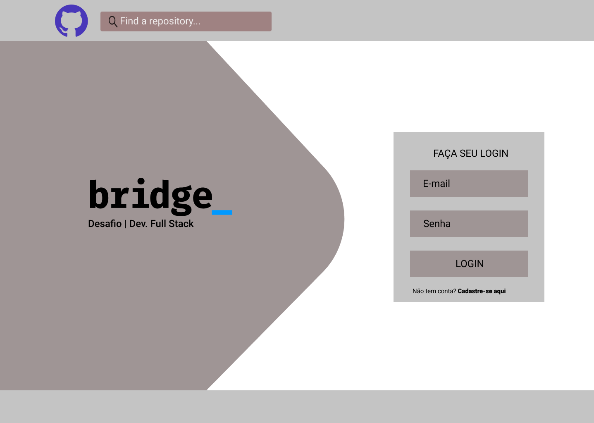
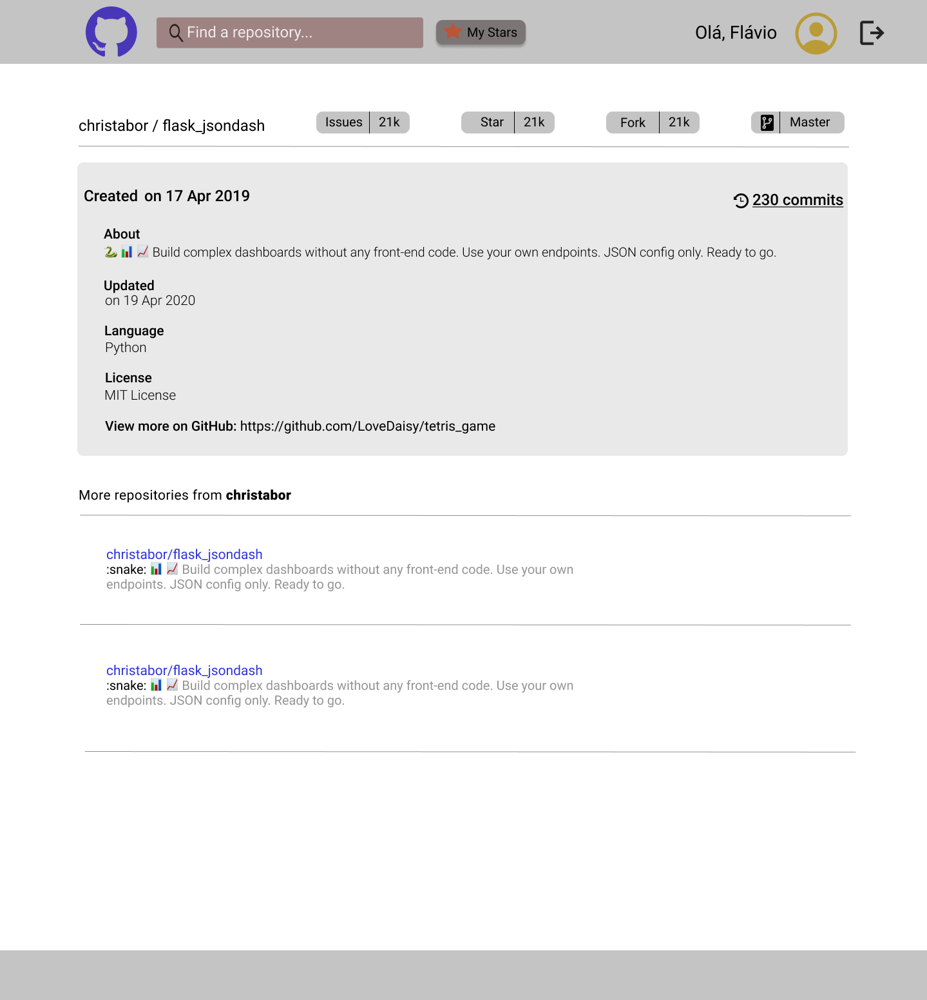

<!-- LANGUAGE -->
<!-- LANGUAGE -->
<!-- LANGUAGE -->
english -
[portuguese](README_pt-br.md)
   

<!-- HEADER -->
<!-- HEADER -->
<!-- HEADER -->
<h1 align="center">Bridge Challenge</h1>

This challenge was proposed to assess technical skills in fullstack development.

        

<!-- DATE -->
<!-- DATE -->
<!-- DATE -->

        September,
        2020

 

<!-- LOCAL -->
<!-- LOCAL -->
<!-- LOCAL -->

        Challenge -
        Intern selection process

        <!-- Análise e Desenvolvimento de Sistemas - -->
        Bridge Laboratory

 

<!-- TEXT -->
<!-- TEXT -->
<!-- TEXT -->
<!-- goals -->
<!--  just objectives, no results or opinions.-->

The development of an application with characteristics of a BFF (Back-end for Front-end) was requested, this one would have the purpose of consuming the Github API. And using a Github username the API needs to retrieve the user repositories. Also, this app must be able to register the starred repositories independently of Github. The development stack had to be Java and React, and the use of Docker was optional. To solve this challenge, three days were made available.

<!-- results -->
<!-- just results, no objectives or opinions -->

The backend solution was developed to receive the user's repositories from Github, filter and save it in a local database (Docker); and only after these operations return the repositories to the frontend with the possibility to toggle the flag of repositories marked as stars. The frontend interface was first made in Figma and then developed in React.

<!-- conclusion -->
<!-- just opinions, no objectives or results -->

So, the biggest challenge was the React framework, as I hadn't worked with it before. Thus, it was necessary to learn while planning and coding the solution. Another difficulty was not having worked with a mocked data solution, so the Github API blocked my requests, making my tests difficult. Due to my inexperience at this point, Bridge did not consider me for the next hiring stages, but they were days of intense learning and development.

 

<!-- TECH -->
<!-- TECH -->
<!-- TECH -->
## Tech stask

        
        
        
        

 

        
        
        
        

 

        
        

 

<!-- IMAGES -->
<!-- IMAGES -->
<!-- IMAGES -->
## Illustrative images

### React app 

        

### Figma concept

        

        

