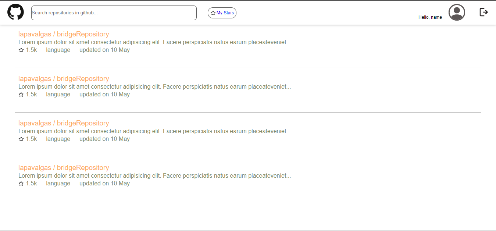
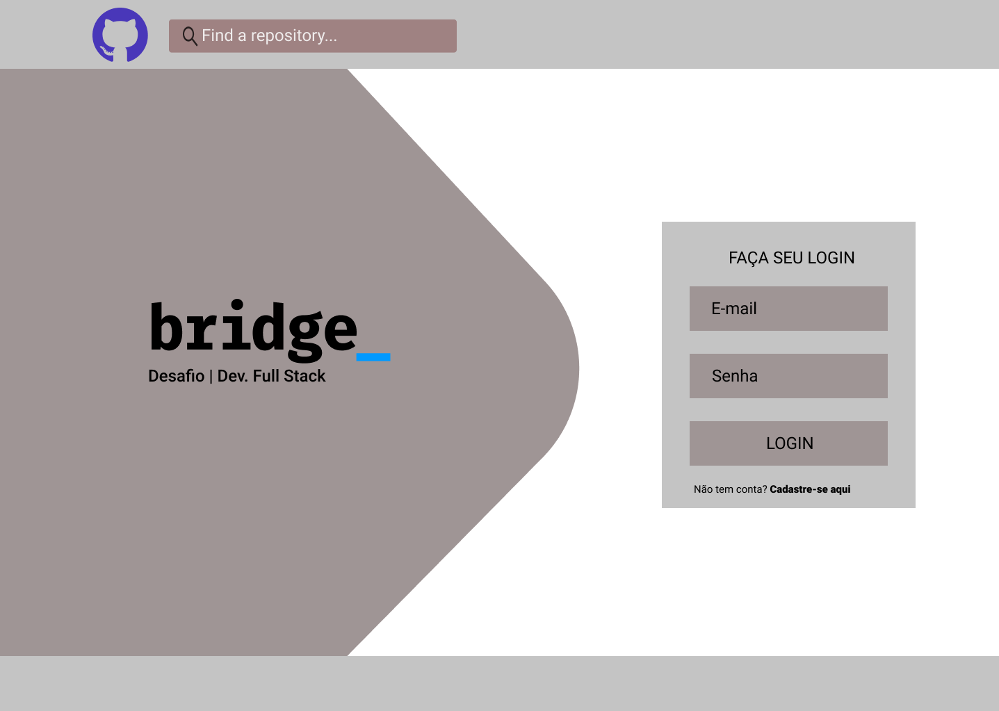
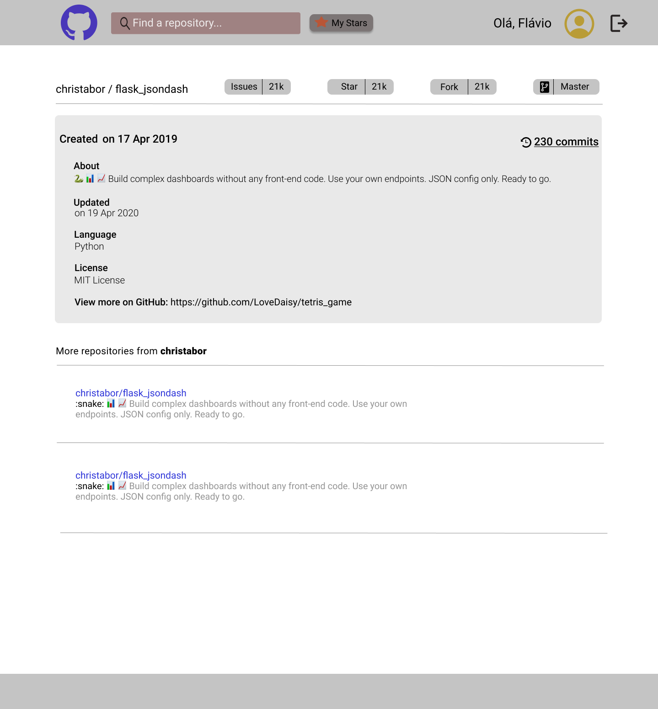

<!-- LANGUAGE -->
<!-- LANGUAGE -->
<!-- LANGUAGE -->
[english](README.md) -
portuguese
   

<!-- HEADER -->
<!-- HEADER -->
<!-- HEADER -->
<h1 align="center">Desafio Bridge</h1>

Esse desafio foi proposto para avaliar as competências técnicas em desenvolvimento fullstack.

        

<!-- DATE -->
<!-- DATE -->
<!-- DATE -->

        Setembro,
        2020

 

<!-- LOCAL -->
<!-- LOCAL -->
<!-- LOCAL -->

        Desafio -
        Processo seletivo estagiários

        <!-- Análise e Desenvolvimento de Sistemas - -->
        Laboratório Bridge

 

<!-- TEXT -->
<!-- TEXT -->
<!-- TEXT -->
<!-- goals -->
<!--  just objectives, no results or opinions.-->

Para avaliar as competências técnicas durante o processo seletivo foi solicitado o desenvolvimento de uma aplicação com características de um BFF que teria a finalidade de consumir a API do Github. E usando um nome de usuário do Github a API precisa recuperar os repositórios do usuário. Além disso, este aplicativo deve ser capaz de registrar os repositórios com estrela de forma independente do Github. A stack de desenvolvimento tinha que ser Java e React, e o uso do Docker era opcional. Para resolver este desafio foram disponibilizados três dias.

<!-- results -->
<!-- just results, no objectives or opinions -->

A solução de backend foi desenvolvida para receber os repositórios do usuário do Github, filtrá-los e salvá-los em um banco de dados local (Docker); e somente após essas operações retornar os repositórios para o frontend com a possibilidade de alternar a flag dos repositórios marcados como estrelas. A interface frontend foi feita primeiro em figma e depois desenvolvida em React.

<!-- conclusion -->
<!-- just opinions, no objectives or results -->

Então, o maior desafio foi o framework React, já que eu não tinha trabalhado com ele antes. Assim, foi necessário aprender ao planejar e codificar a solução. Outra dificuldade foi não ter trabalhado com uma solução de dados simulados, então a API do Github bloqueou minhas requisições, dificultando meus testes. Devido à minha inexperiência neste momento, a Bridge não me considerou para as próximas etapas de contratação, mas foram dias de intenso aprendizado e desenvolvimento.

 

<!-- TECH -->
<!-- TECH -->
<!-- TECH -->
## Tech stask

        
        
        
        

 

        
        
        
        

 

        
        

 

<!-- IMAGES -->
<!-- IMAGES -->
<!-- IMAGES -->
## Illustrative images

### React app 

        

### Figma concept

        

        

