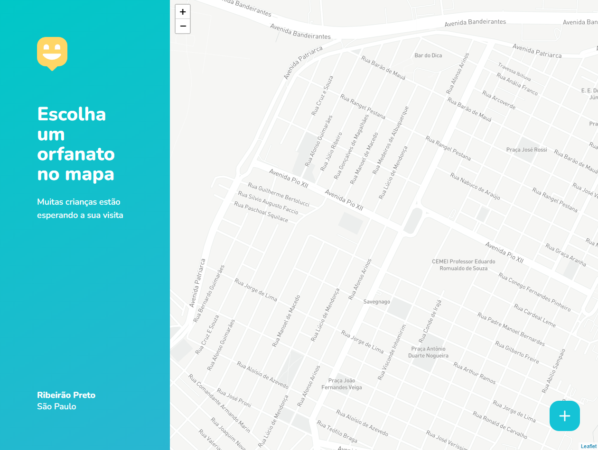

<!-- LANGUAGE -->
<!-- LANGUAGE -->
<!-- LANGUAGE -->
english -
[portuguese](README_pt-br.md)
   

<!-- HEADER -->
<!-- HEADER -->
<!-- HEADER -->
<h1 align="center">Happy</h1>

This project is the result of Team Rocketseat's NLW week.

        

<!-- DATE -->
<!-- DATE -->
<!-- DATE -->

        October,
        2020

 

<!-- LOCAL -->
<!-- LOCAL -->
<!-- LOCAL -->

        React -
        Next Level Week (NLW)

        <!-- Análise e Desenvolvimento de Sistemas - -->
        RocketSeat

 

<!-- TEXT -->
<!-- TEXT -->
<!-- TEXT -->
<!-- goals -->
<!--  just objectives, no results or opinions.-->

The NLW is a week of immersion in the React framework offered by the Rocketseat school. It is an event that takes place a few times a year and usually precedes the school's enrollment periods. Each event has a theme that determines the application developed. In this version of the event, the theme was social assistance and the application aimed to register shelters on a map. The application was developed in REST architecture so that the API was consumed by a web and a mobile frontend.

<!-- results -->
<!-- just results, no objectives or opinions -->

The backend was developed in JavaScript with ExpressJs. The frontend was developed with React, the mobile version with REACT Native and EXPO.
 
<!-- conclusion -->
<!-- just opinions, no objectives or results -->

In this process I had my first experience developing a javascript backend with ExpressJs, allowing me to understand the counterpoints that this technology makes with Java and Python. Also the first time I made a REST backend to be distributed in web and mobile frontends, so I could see the power of this systems architecture. It was also the first time that I worked with geolocation and maps applications.

 

<!-- TECH -->
<!-- TECH -->
<!-- TECH -->
## Tech stask

        
        
        

 

        
        
        
        

 

<!-- IMAGES -->
<!-- IMAGES -->
<!-- IMAGES -->
## Illustrative images

        

