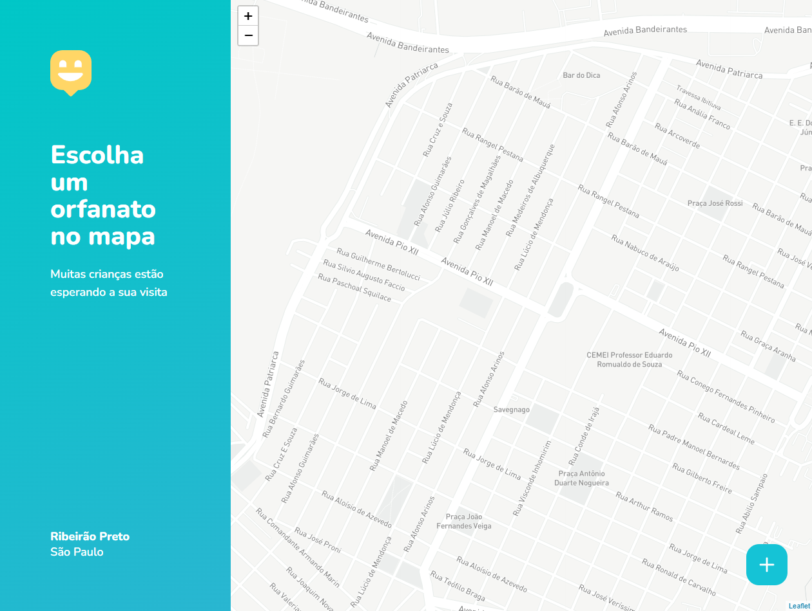

<!-- LANGUAGE -->
<!-- LANGUAGE -->
<!-- LANGUAGE -->
[english](README.md) -
portuguese
   

<!-- HEADER -->
<!-- HEADER -->
<!-- HEADER -->
<h1 align="center">Happy</h1>

Esse projeto é resultado da semana NLW da equipe Rocketseat.

        

<!-- DATE -->
<!-- DATE -->
<!-- DATE -->

        Outubro,
        2020

 

<!-- LOCAL -->
<!-- LOCAL -->
<!-- LOCAL -->

        React -
        Next Level Week (NLW)

        <!-- Análise e Desenvolvimento de Sistemas - -->
        RocketSeat

 

<!-- TEXT -->
<!-- TEXT -->
<!-- TEXT -->
<!-- goals -->
<!--  just objectives, no results or opinions.-->

A NLW é uma semana de imersão no framework React oferecido pela escola Rocketseat. É um evento que ocorre poucas vezes no ano e costuma anteceder aos períodos de matrículas da escola. Cada evento possui uma temática que determina a aplicação desenvolvida. Nessa versão do evento a temática era assistência social e a aplicação tinha por objetivo registrar casas de acolhimento em um mapa. A aplicação foi desenvolvida em arquitetura REST para que a API fosse consumida por um frontend web e outro mobile.

<!-- results -->
<!-- just results, no objectives or opinions -->

O backend foi desenvolvido em JavaScript com ExpressJs. O frontend foi desenvolvido com React, a versão mobile com REACT Native e o EXPO.
 
<!-- conclusion -->
<!-- just opinions, no objectives or results -->

Nesse processo tive a minha primeira experiencia desenvolvendo um backend em javascript com ExpressJs, me possibilitando entender os contrapontos que essa tecnologia faz com Java e o Python. Também a primeira vez que fiz um backend REST para ser distribuido em frontend web e mobile, assim pude constatar o poder dessa arquitetura de sistemas. Foi também a primeira vez que trabalhei com aplicações de geolocalização e mapas.

 

<!-- TECH -->
<!-- TECH -->
<!-- TECH -->
## Tech stask

        
        
        

 

        
        
        
        

 

<!-- IMAGES -->
<!-- IMAGES -->
<!-- IMAGES -->
## Illustrative images

        

