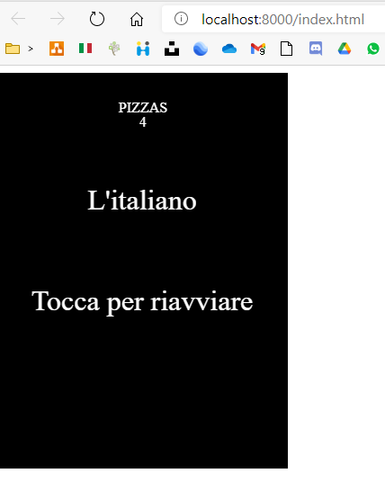

<!-- LANGUAGE -->
<!-- LANGUAGE -->
<!-- LANGUAGE -->
english -
[portuguese](README_pt-br.md)
   

<!-- HEADER -->
<!-- HEADER -->
<!-- HEADER -->
<h1 align="center">Mammamia Videogame</h1>

This was a challenge in the mobile development course.

        

<!-- DATE -->
<!-- DATE -->
<!-- DATE -->

        October,
        2020

 

<!-- LOCAL -->
<!-- LOCAL -->
<!-- LOCAL -->

        JavaScript EnchantJS -
        Linguagem de Programação III

        Análise e Desenvolvimento de Sistemas -
        Centro Universitário de São José

 

<!-- TEXT -->
<!-- TEXT -->
<!-- TEXT -->
<!-- goals -->
<!--  just objectives, no results or opinions.-->

In the mobile development class, teacher launched the challenge to develop a game using a framework called EnchantJs. No other requirements were requested.

<!-- results -->
<!-- just results, no objectives or opinions -->

I studied for a while how the framework works and analyzed some open-source games to understand how this framework was used. I decided to create a game about a pizza maker preparing pizzas. The game mechanics were adapted from another game, in the base game the player controlled a dolphin and had to dodge rocks in the middle of the way, in my game, the player controls a pizza maker who must collect pizzas.

<!-- conclusion -->
<!-- just opinions, no objectives or results -->

This challenge was one of the most interesting of the entire undergraduate course. Who has never thought of developing a game? So, despite being an experiment with a small and discontinued framework, it was a lot of fun having to think about the theme and code the game.

 

<!-- TECH -->
<!-- TECH -->
<!-- TECH -->
## Tech stask

        
        
        

 

<!-- IMAGES -->
<!-- IMAGES -->
<!-- IMAGES -->
## Illustrative images

### O jogo

        

### Gameover

        

