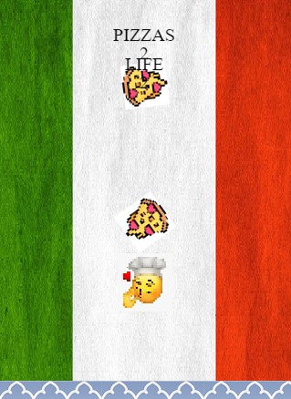
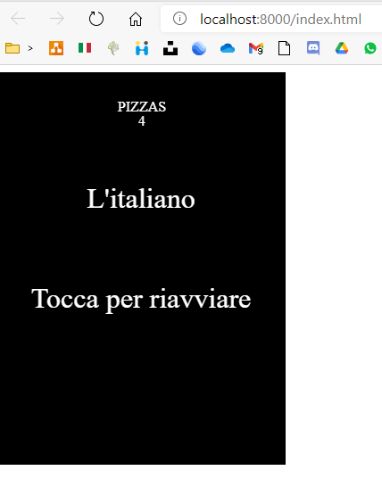

<!-- LANGUAGE -->
<!-- LANGUAGE -->
<!-- LANGUAGE -->
[english](README.md) -
portuguese
   

<!-- HEADER -->
<!-- HEADER -->
<!-- HEADER -->
<h1 align="center">Mammamia Videogame</h1>

Esse foi um desafio no curso de desenvolvimento mobile.

        

<!-- DATE -->
<!-- DATE -->
<!-- DATE -->

        Outubro,
        2020

 

<!-- LOCAL -->
<!-- LOCAL -->
<!-- LOCAL -->

        JavaScript EnchantJS -
        Linguagem de Programação III

        Análise e Desenvolvimento de Sistemas -
        Centro Universitário de São José

 

<!-- TEXT -->
<!-- TEXT -->
<!-- TEXT -->
<!-- goals -->
<!--  just objectives, no results or opinions.-->

Durante o curso de desenvolvimento mobile, o professor lançou o desafio de desenvolver um jogo utilizando um framework chamado EnchantJs. Nenhum outro requisito foi solicitado.

<!-- results -->
<!-- just results, no objectives or opinions -->

Estudei por um tempo como funciona o framework e analisei alguns jogos de código aberto para entender como esse framework era usado. Resolvi criar um jogo sobre um pizzaiolo preparando pizzas. A mecânica do jogo foi adaptada de outro jogo, neste o jogador controlava um golfinho e tinha que desviar de pedras no meio do caminho, no meu jogo o jogador controla um pizzaiolo que deve coletar pizzas.

<!-- conclusion -->
<!-- just opinions, no objectives or results -->

Esse desafio foi um dos mais interessantes de todo o curso de graduação. Quem nunca pensou em desenvolver um jogo? Então, apesar de ser um experimento com um framework pequeno e descontinuado, foi muito divertido ter que pensar no tema e codificar o jogo.

 

<!-- TECH -->
<!-- TECH -->
<!-- TECH -->
## Tech stask

        
        
        

 

<!-- IMAGES -->
<!-- IMAGES -->
<!-- IMAGES -->
## Illustrative images

### O jogo

        

### Gameover

        

