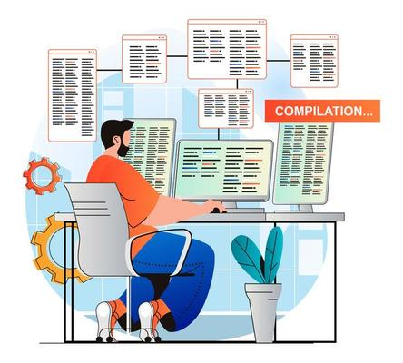

<!-- LANGUAGE -->
<!-- LANGUAGE -->
<!-- LANGUAGE -->
english -
[portuguese](README_pt-br.md)
   

<!-- HEADER -->
<!-- HEADER -->
<!-- HEADER -->
<h1 align="center">UpFlux challenge</h1>

This challenge was proposed to assess technical skills in fullstack development.

        

<!-- DATE -->
<!-- DATE -->
<!-- DATE -->

        October,
        2021

 

<!-- LOCAL -->
<!-- LOCAL -->
<!-- LOCAL -->

        Desafio -
        Fullstack selection process

        <!-- Análise e Desenvolvimento de Sistemas - -->
        UpFlux

 

<!-- TEXT -->
<!-- TEXT -->
<!-- TEXT -->
<!-- goals -->
<!--  just objectives, no results or opinions.-->

The challenge was to develop a book rental system with frontend and backend. 8 hours were available to complete. The requirements are in the checklist:

<!-- results -->
<!-- just results, no objectives or opinions -->
<!-- 
 -->

- [x] Backend - API REST
- [ ] Frontend
- [ ] Unit Test
- [x] Search all books by any 1 of 3 fields
- [x] Store the data in a document-oriented database
- [x] List all books sorted by the most borrowed
- [x] View if the book is available
- [x] Readable code
- [x] Solution written in C# or Java
- [x] Make source code available in a Github repository
- [x] Readme on how to run and use the project

<!-- 
 -->
<!-- conclusion -->
<!-- just opinions, no objectives or results -->

In the time available it was only possible to complete the backend, I developed a REST API in java spring. But I believe there was a bad time management, as I did all the error and exception handling and that was not part of the requirements. So I sacrificed the unit tests and frontend. If I had time, I would have developed the frontend in Angular and Bootstrap. The biggest challenge of this selection process was the short time to develop this small system. UpFlux company did not consider me as a possible employee.

 

<!-- TECH -->
<!-- TECH -->
<!-- TECH -->
## Tech stask

        
        
        
        

 

        
        

 