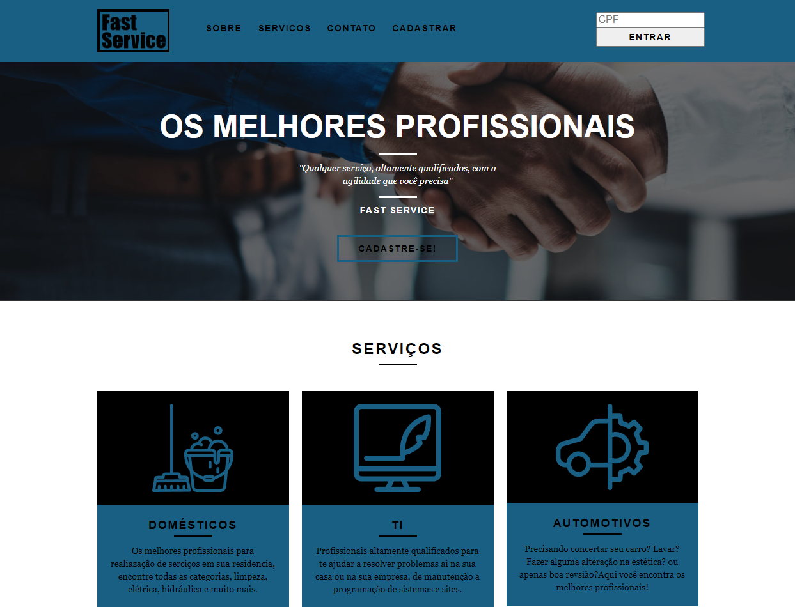
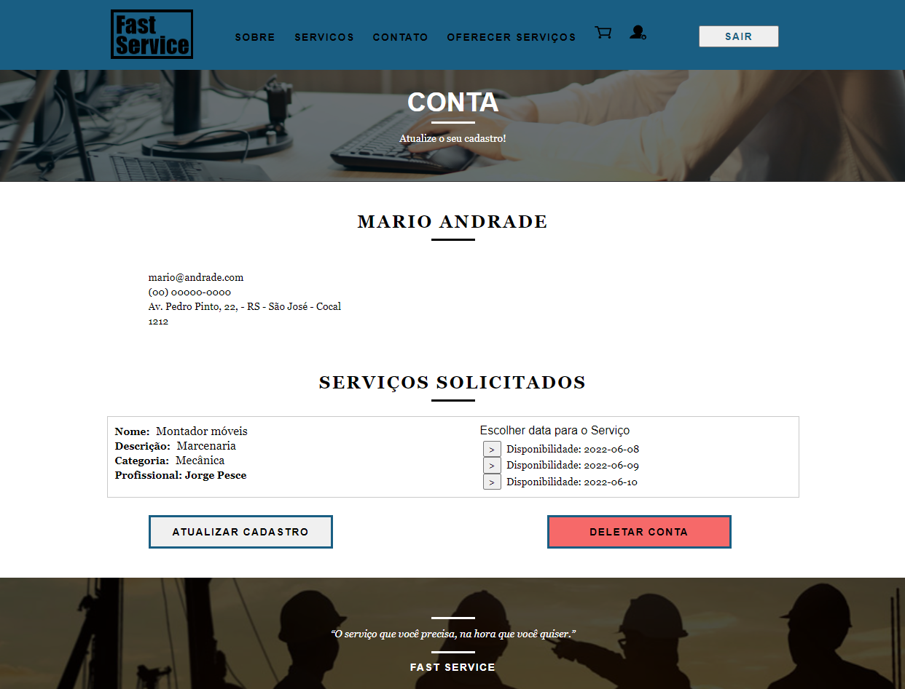

<!-- LANGUAGE -->
<!-- LANGUAGE -->
<!-- LANGUAGE -->
english -
[portuguese](README_pt-br.md)
<br>  


<!-- HEADER -->
<!-- HEADER -->
<!-- HEADER -->
<h1 align="center">Fast Service</h1>
<p align="center">Final project of the undergraduate course in Systems Analysis and Development</p>
<br>  

<p align="center">
        
</p>

<!-- DATE -->
<!-- DATE -->
<!-- DATE -->
<p align="center">
        <span>June</span>,
        <span>2021</span></p>
<br>


<!-- LOCAL -->
<!-- LOCAL -->
<!-- LOCAL -->
<p align="center">
        <span>Final exam</span> -
        <span>Projeto Integrador II</span></p>
<p align="center">
        <span>Análise e Desenvolvimento de Sistemas</span> -
        <span>Centro Universitário de São José</span></p>
<br>


<!-- TEXT -->
<!-- TEXT -->
<!-- TEXT -->
<!-- goals -->
<!--  just objectives, no results or opinions.-->
<p align="left">The final assessment of the Integrator Project requires students to develop an MVP system (minimum viable product). So students need to choose a business and then design and code the system. The development stack is not a criterion for approval as long as the MVP has a relational database, a backend and frontend. Thus, the result expected by the institution is a functional MVP web system available online.</p>
<!-- results -->
<!-- just results, no objectives or opinions -->
<p align="left">I chose as business the Fast Service, a system for users offers and hire services, that is, basically a service marketplace. The developed system contemplated the following features: registration and authentication of users, availability, contracting and evaluation of services. The system was developed using Java and the Spring framework for the backend, available online by the Heroku platform. The frontend was developed with the VueJs framework, available online by the Vercel platform. And it was developed in a local environment with infrastructure guaranteed by Docker and MySQL.</p>
<!-- conclusion -->
<!-- just opinions, no objectives or results -->
<p align="left">So, at the end of the development, I was pleased to see the results of my learning during the graduation period. There is still a lot to learn, but I feel that this knowledge base is fundamental for any next step.</p>
<br>

<!-- TEST -->
<!-- TEST -->
<!-- TEST -->
## Testing application
https://fastservice.vercel.app/

</br>


<!-- GUIDES -->
<!-- GUIDES -->
<!-- GUIDES -->
# Getting Started

## Prerequisites
- [x] <a href="https://www.docker.com/">Docker</a>

##  Installation
1. Run Docker 
2. Run and wait the containers up: 
```
code/src/docker-compose up
```
3. Go to the link: <a href="">http://localhost:8082/</a> 


## Usage 
<!-- conclusion -->
<p align="left">To test the application it will be necessary to use two browsers to register two users in the application. After that, just use the platform to offer services with one user and contract with the other user.</p>


<!-- TECH -->
<!-- TECH -->
<!-- TECH -->
## Tech stask
<div style="display: flex; justify-content: left;">
        
        
        
        
</div>
<br>
<div style="display: flex; justify-content: left;">
        
        
        
        
</div>
<br>
<div style="display: flex; justify-content: left;">
        
        
</div>
<br>


<!-- IMAGES -->
<!-- IMAGES -->
<!-- IMAGES -->
## Illustrative images

### Image title
<div>
        
</div>
<div>
        
</div>
<div>
        
</div>
<div>
        
</div>
<div>
        
</div>
<div>
        
</div>