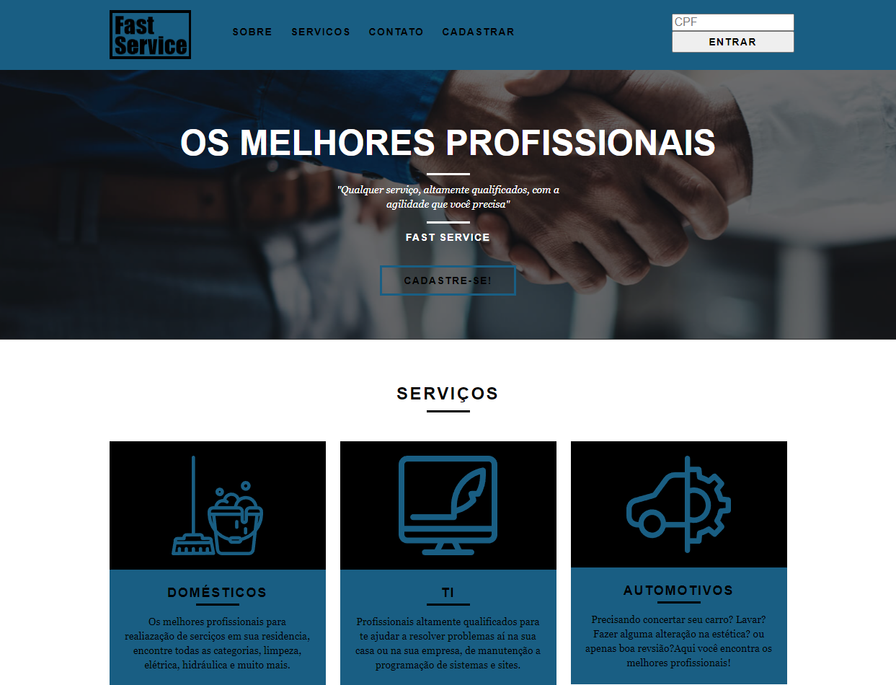
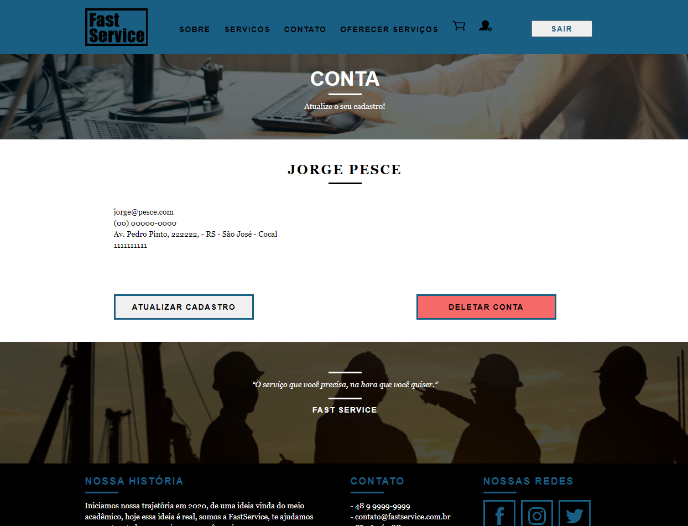
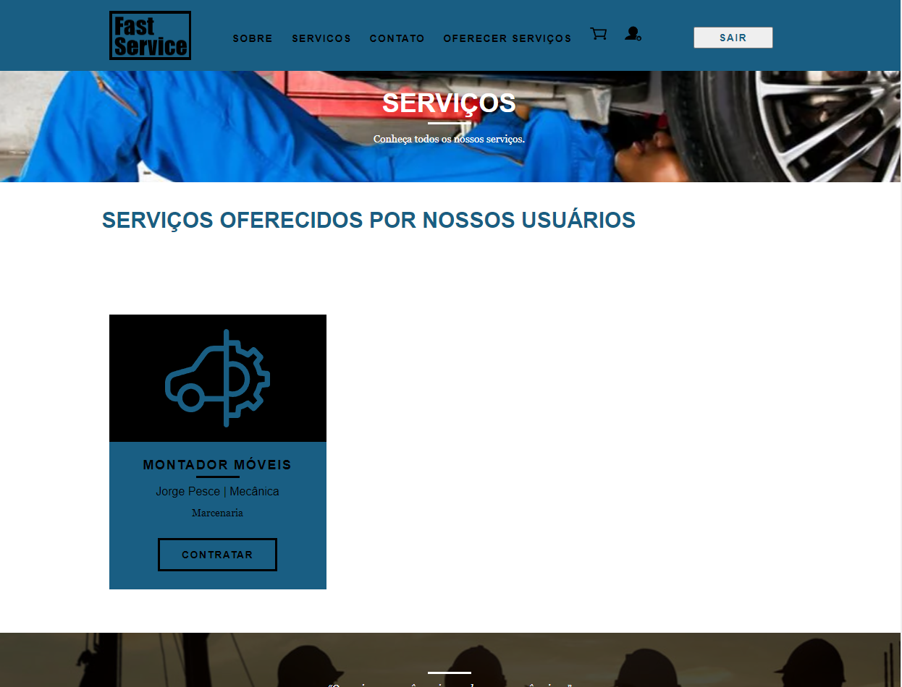
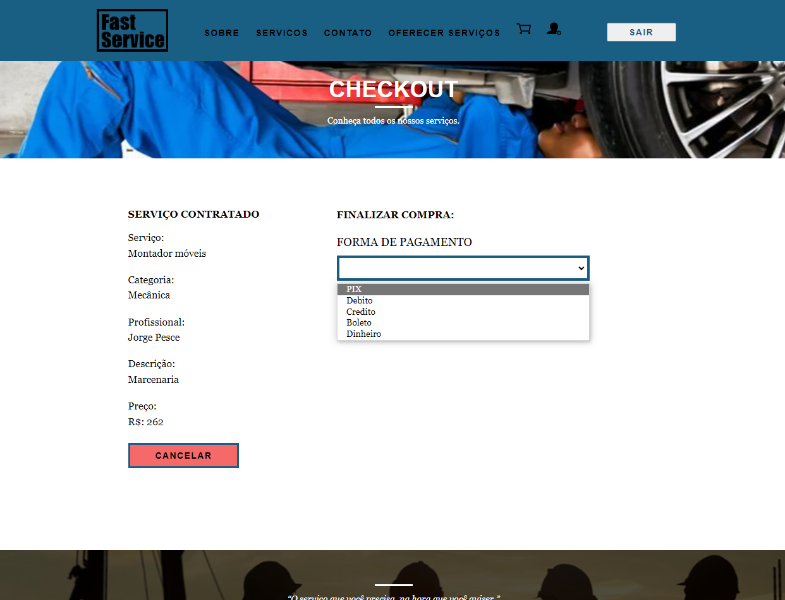
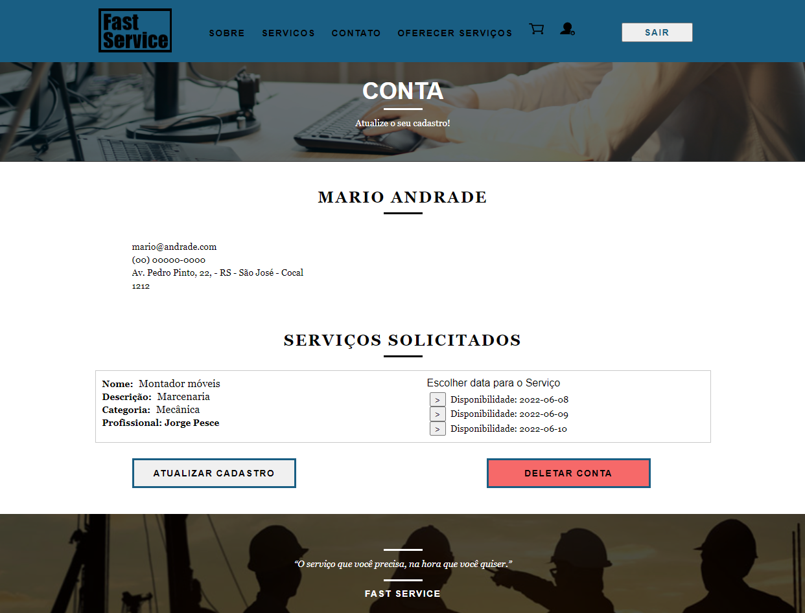
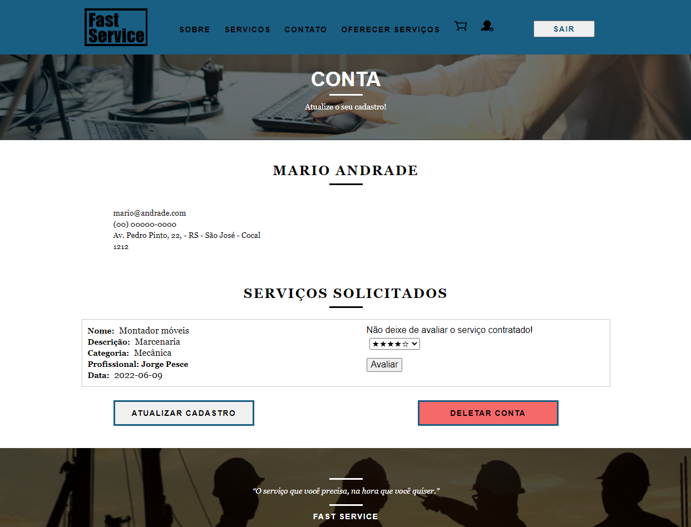

<!-- LANGUAGE -->
<!-- LANGUAGE -->
<!-- LANGUAGE -->
[english](README.md) -
portuguese
<br>  


<!-- HEADER -->
<!-- HEADER -->
<!-- HEADER -->
<h1 align="center">Fast Service</h1>
<p align="center">Projeto final do curso de graduação em Análise e Desenvolvimento de Sistemas</p>
<br>  

<p align="center">
        
</p>

<!-- DATE -->
<!-- DATE -->
<!-- DATE -->
<p align="center">
        <span>Junho</span>,
        <span>2021</span></p>
<br>


<!-- LOCAL -->
<!-- LOCAL -->
<!-- LOCAL -->
<p align="center">
        <span>Avaliação final</span> -
        <span>Projeto Integrador II</span></p>
<p align="center">
        <span>Análise e Desenvolvimento de Sistemas</span> -
        <span>Centro Universitário de São José</span></p>
<br>


<!-- TEXT -->
<!-- TEXT -->
<!-- TEXT -->
<!-- goals -->
<!--  just objectives, no results or opinions.-->
<p align="left">A avaliação final do Projeto Integrador exige que os alunos desenvolvam um sistema MVP (produto mínimo viável). Assim, os alunos precisam escolher um negócio e, em seguida, projetar e codificar o sistema. A pilha de desenvolvimento não é um critério para aprovação desde que o MVP tenha um banco de dados relacional, um back-end e um front-end. Assim, o resultado esperado pela instituição é um sistema web MVP funcional disponível online.</p>
<!-- results -->
<!-- just results, no objectives or opinions -->
<p align="left">Escolhi como negócio o Fast Service, um sistema para oferta e contratação de serviços aos usuários, ou seja, basicamente um marketplace de serviços. O sistema desenvolvido contemplou as seguintes funcionalidades: cadastro e autenticação de usuários, disponibilidade, contratação e avaliação de serviços. O sistema foi desenvolvido utilizando Java e o framework Spring para backend, disponibilizado online pela plataforma Heroku. O frontend foi desenvolvido com o framework VueJs, disponibilizado online pela plataforma Vercel. E foi desenvolvido em ambiente local com infraestrutura garantida por Docker e MySQL.</p>
<!-- conclusion -->
<!-- just opinions, no objectives or results -->
<p align="left">Ao final do desenvolvimento tive o prazer de ver os resultados do meu aprendizado durante a graduação. Ainda há muito o que aprender, mas sinto que essa base de conhecimento é fundamental para qualquer próximo passo.</p>
<br>

<!-- TEST -->
<!-- TEST -->
<!-- TEST -->
## Testing application
https://fastservice.vercel.app/

</br>


<!-- GUIDES -->
<!-- GUIDES -->
<!-- GUIDES -->
# Getting Started

## Prerequisites
- [x] <a href="https://www.docker.com/">Docker</a>

##  Installation
1. Run Docker 
2. Run and wait the containers up: 
```
code/src/docker-compose up
```
3. Go to the link: <a href="">http://localhost:8082/</a> 


### Usage 
<!-- conclusion -->
<p align="left">Para testar a aplicação será necessário utilizar dois navegadores para cadastrar dois usuários na aplicação. Após isso basta utilizar a plataforma para oferecer serviços com um usuário e contratar com o outro.</p>


<!-- TECH -->
<!-- TECH -->
<!-- TECH -->
## Tech stask
<div style="display: flex; justify-content: left;">
        
        
        
        
</div>
<br>
<div style="display: flex; justify-content: left;">
        
        
        
        
</div>
<br>
<div style="display: flex; justify-content: left;">
        
        
</div>
<br>


<!-- IMAGES -->
<!-- IMAGES -->
<!-- IMAGES -->
## Illustrative images

### Image title
<div>
        
</div>
<div>
        
</div>
<div>
        
</div>
<div>
        
</div>
<div>
        
</div>
<div>
        
</div>